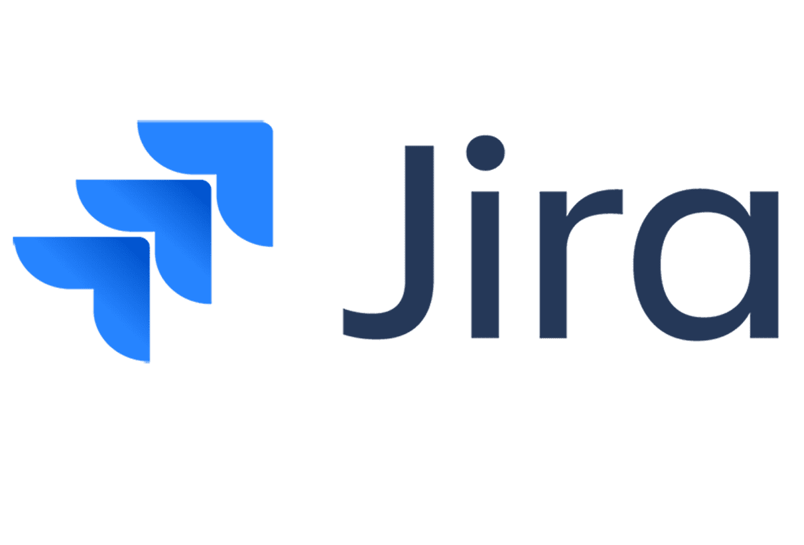
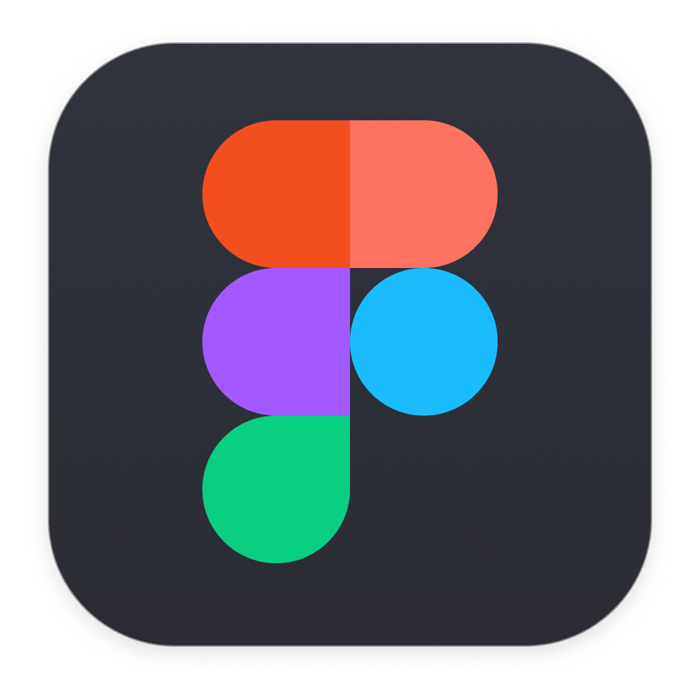
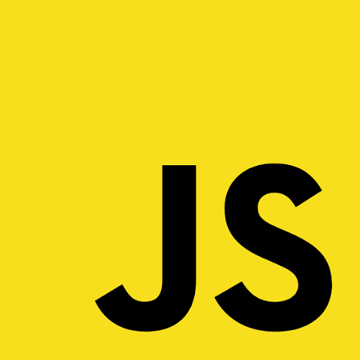
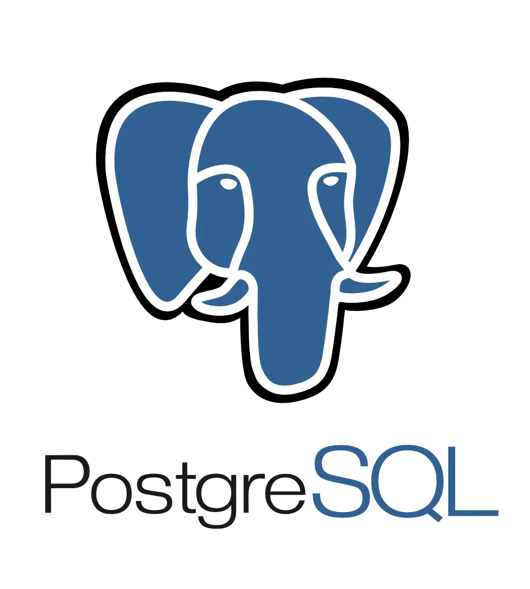
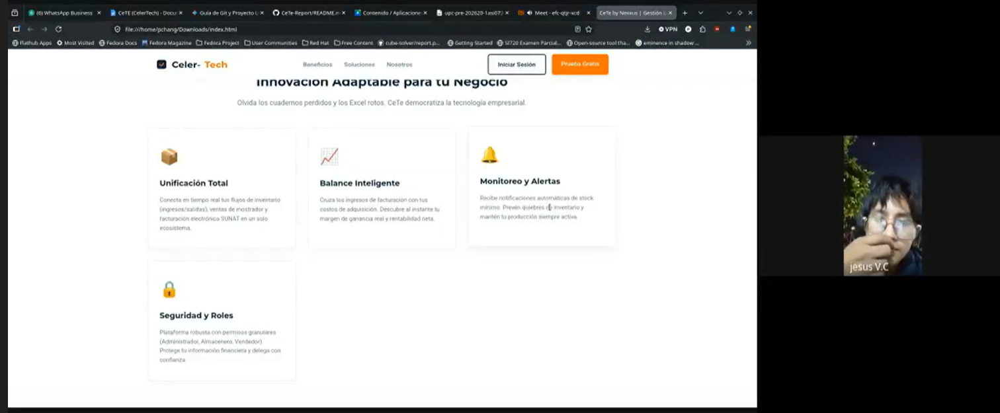
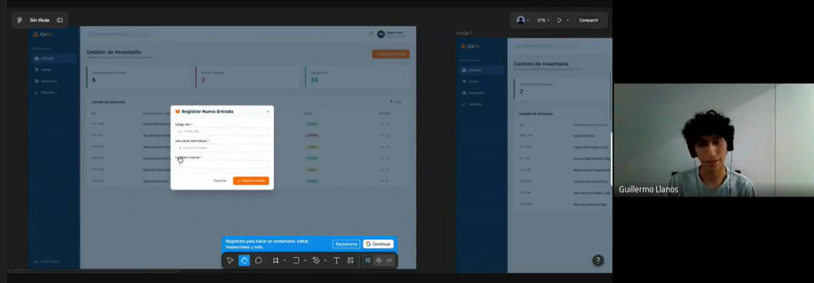

# Capítulo V: Product Implementation, Validation & Deployment

## 5.1. Software Configuration Management

La Gestión de Configuración de Software (SCM) es la disciplina que permite identificar, controlar, versionar y auditar los distintos componentes de un sistema durante todo su ciclo de vida. Su aplicación asegura la trazabilidad de los cambios realizados sobre el código fuente, la documentación y los artefactos de diseño, reduciendo la probabilidad de errores de integración y facilitando el trabajo colaborativo del equipo.

En el caso de **CeTe**, la solución está compuesta por una Landing Page informativa, una Frontend Web Application y un RESTful API de elaboración interna. Durante el **Sprint 1** se priorizó la implementación, validación y despliegue de la primera versión de la **Landing Page**, desarrollada con HTML5, CSS3 y JavaScript (ES6+), manteniendo un comportamiento 100% responsive y sin dependencias de frameworks externos.

### 5.1.1. Software Development Environment Configuration

A continuación se listan los productos de software utilizados por el equipo, organizados por tipo de actividad del ciclo de vida. Para cada herramienta se indica su propósito dentro de CeTe y la ruta de referencia o descarga.

**1. Project Management**

*Descripción:* La gestión del proyecto permite organizar las actividades necesarias para alcanzar los objetivos del Sprint, asignar responsables, dar seguimiento al avance y mantener la comunicación entre los integrantes del equipo.

**Jira Software / Trello:**
Utilizado para la gestión del Product Backlog, Sprint Backlog y el seguimiento de las User Stories y Technical Stories. ([Atlassian](https://www.atlassian.com/software/jira))

  

**Google Meet & WhatsApp:**
Empleados para las ceremonias formales de Scrum (Daily, Planning, Review) y como canales de comunicación asincrónica para coordinar avances diarios.

  
  

**2. Requirements Management**

**UXPressia:**
Utilizado para la elaboración de los User Personas, Empathy Maps, Journey Maps e Impact Maps, facilitando la identificación de necesidades de los dueños de MYPEs y operarios logísticos. ([UXPressia](https://uxpressia.com/))

  

**3. Product UX/UI Design**

**Figma:**
Herramienta de diseño colaborativo en la nube empleada para elaborar los wireframes, mockups y el prototipo interactivo de CeTe, documentando nuestro Design System. ([Figma](https://www.figma.com/))

  

**4. Software Development**

**Visual Studio Code / WebStorm:**
Editores principales para el desarrollo Frontend (HTML, CSS, JS, Vue.js). La configuración de formato se estandariza mediante el archivo `.editorconfig`. ([VS Code](https://code.visualstudio.com/))

  

**Visual Studio 2022 / JetBrains Rider:**
Entornos de desarrollo integrados (IDE) robustos utilizados para la programación del Backend en C# con .NET 8.

  

**HTML5 / CSS3 / JavaScript (ES6+):**
Tecnologías base de la Landing Page desplegada en el Sprint 1.

  
  
  

**Vue.js & PrimeVue:**
Framework progresivo y biblioteca de componentes seleccionados para el desarrollo de la Single Page Application (Web App de Inventario y Ventas).

  

**ASP.NET Core & C#:**
Framework y lenguaje utilizados para el desarrollo del RESTful API de CeTe, responsable de la lógica de negocio orientada a dominio (DDD).

  

**Entity Framework Core & PostgreSQL:**
ORM y base de datos relacional definidos para almacenar el estado transaccional, inventario y métricas de CeTe.

  

**Git & GitHub:**
Sistema de control de versiones y plataforma de colaboración para alojar repositorios, aplicar GitFlow y Pull Requests.

  

**5. Software Deployment**

**GitHub Pages:**
Servicio de alojamiento estático utilizado para publicar la primera versión de la Landing Page de CeTe directamente desde la rama `main`.

  

### 5.1.2. Source Code Management

La administración del código fuente es un pilar del trabajo colaborativo del equipo. En este apartado se define el modelo organizativo y de control de versiones aplicado mediante GitHub y el flujo de trabajo GitFlow.

**1. Establecimiento de repositorios en GitHub**

La solución distribuida de CeTe se organiza en repositorios independientes:
* **Landing Page:** Repositorio dedicado al sitio web promocional del producto.
* **Frontend Web Application:** Repositorio destinado a la aplicación web (Vue.js).
* **RESTful API:** Repositorio que aloja la lógica del backend (ASP.NET Core).
* **Project Report:** Repositorio destinado a la redacción del informe en Markdown.

**2. Workflow de control de versiones (GitFlow)**

| Nombre de la rama | Descripción |
| :--- | :--- |
| **Main Branch** (`main`) | Rama base que refleja el estado de producción. Es la rama publicada por GitHub Pages. |
| **Develop Branch** (`develop`) | Rama de integración del equipo. Unifica el código de las funcionalidades en curso. |
| **Feature Branches** (`feature/*`) | Ramas temporales para desarrollar funcionalidades aisladas.   **Convención:** `feature/nombre-de-la-funcionalidad` |
| **Release Branches** (`release/*`) | Ramas de estabilización previas al pase a producción.   **Convención:** `release/vX.Y.Z` |

**3. Versionado Semántico (Semantic Versioning 2.0.0)**

CeTe adopta el estándar **Semantic Versioning 2.0.0** (`MAJOR.MINOR.PATCH`).
* Ejemplo: `v1.0.0` (Primera versión desplegada de la Landing Page).

**4. Convenciones de mensajes de commit (Conventional Commits)**

* `feat:` incorpora una funcionalidad nueva.
* `fix:` corrige un error.
* `docs:` modifica exclusivamente documentación.
* `style:` aplica ajustes de formato visual.
* `refactor:` reestructura código existente sin añadir funcionalidades.
* `chore:` tareas de mantenimiento y configuración.

### 5.1.3. Source Code Style Guide & Conventions

Como regla transversal, **toda la nomenclatura técnica (identificadores, clases, variables, funciones y métodos) se redacta exclusivamente en inglés**.

**HTML & CSS**
* Indentación de 2 espacios.
* Uso de metodología **BEM** (Block, Element, Modifier) para las clases CSS.
* Uso de *Custom Properties* (`:root`) para la paleta de colores corporativa (Primary Blue, Accent Orange).

**C# (.NET Core)**
* Indentación de 4 espacios.
* Nomenclatura `PascalCase` para clases y métodos (`InventoryController`), `camelCase` para variables locales.
* Aplicación estricta de inyección de dependencias y programación asíncrona (`Async`).

### 5.1.4. Software Deployment Configuration

**1. Landing Page (GitHub Pages)**
* **Plataforma de hosting:** GitHub Pages.
* **Origen del despliegue:** contenido estático de la rama `main` del repositorio.
* Se incorpora el archivo `.nojekyll` para garantizar la correcta carga de la carpeta `/assets`.

**2. Frontend y RESTful API (Proyección)**
El despliegue de las aplicaciones reactivas y servicios backend se configurará utilizando servicios Cloud escalables (Ej. Azure App Services, AWS o Vercel), garantizando alta disponibilidad para las MYPES.

## 5.2. Landing Page, Services & Applications Implementation

### 5.2.1. Sprint 1

Durante el Sprint 1, el equipo de Nexxus se concentró en la implementación y despliegue de la primera versión funcional y responsive de la Landing Page de CeTe, diseñada para captar a nuestro público objetivo (Dueños de MYPEs y Operarios).

#### 5.2.1.1. Sprint Planning 1

| Sprint # | Sprint 1 |
| :--- | :--- |
| **Sprint Planning Background** | |
| Date | 08/09/2026 |
| Time | 8:00 PM |
| Location | Google Meet (reunión virtual) |
| Prepared By | Salazar Marquina, Kevin Junior |
| Attendees | Anahua Ancachi, Liz Maribel Campoblanco Guzman, Diego Roberto Montes Chang, Piero Francisco Salazar Marquina, Kevin Junior Salazar Quiche, Darikson Bill |
| **Sprint 1 Review Summary** | Durante este primer ciclo el equipo consolidó los artefactos de UX definidos en los capítulos anteriores y los tradujo en una implementación web funcional. Se desarrolló y desplegó la primera versión de la Landing Page de CeTe, la cual comunica la propuesta de valor orientada a la centralización B2B de inventario y ventas. Se implementaron el Hero section, los planes de suscripción, diseño responsive y adaptabilidad móvil. |
| **Sprint 1 Retrospective Summary** | El equipo evaluó positivamente la distribución del trabajo mediante la convención de ramas `feature/*` de GitFlow, reduciendo colisiones de código. Como oportunidad de mejora, se debe afinar la estimación de las tareas de internacionalización (i18n) para el próximo ciclo. |
| **Sprint Goal & User Stories** | |
| **Sprint 1 Goal** | *Our focus is on* publicar la primera versión funcional y responsive de la Landing Page de CeTe. *We believe it delivers* a las MYPES una comprensión rápida de nuestra solución B2B. *This will be confirmed when* el sitio sea accesible desde cualquier dispositivo, mostrando claramente la propuesta y los planes de suscripción. |
| **Sprint 1 Velocity** | 24 |
| **Sum of Story Points** | 24 |

#### 5.2.1.2. Aspect Leaders and Collaborators

| Team Member | Landing Page (código) | Diseño UI/UX | Documentación | Deployment |
| :--- | :--- | :--- | :--- | :--- |
| Anahua Ancachi, Liz | Colaborador | Líder | Colaborador | Colaborador |
| Campoblanco, Diego | Colaborador | Colaborador | Colaborador | Líder |
| Montes Chang, Piero | Colaborador | Colaborador | Líder | Colaborador |
| Salazar, Kevin | Líder | Colaborador | Colaborador | Colaborador |
| Salazar, Darikson | Colaborador | Colaborador | Colaborador | Colaborador |

#### 5.2.1.3. Sprint Backlog 1

| Story ID | Work Item / Task Title | Description | Est. (h) | Assigned To | Status |
| :--- | :--- | :--- | :---: | :--- | :---: |
| US24 | Estructuración base e implementación del Hero | Creación del esqueleto semántico (`header`, `main`, `section`, `footer`) y propuesta de valor principal. | 4 | Salazar, Kevin | Done |
| US25 | Implementación de la sección de Funcionalidades | Maquetación de la grilla mostrando "Inventario en tiempo real", "Dashboard", etc. | 3 | Anahua, Liz | Done |
| US26 | Maquetación de la sección de Planes | Tarjetas de suscripción con precios para las MYPES. | 3 | Salazar, Darikson | Done |
| US29 | Implementación de navegación responsive | Desarrollo del header fijo, scroll suave y menú hamburguesa para móviles. | 4 | Campoblanco, Diego | Done |
| US33 | Implementación del Footer Institucional | Creación del pie de página con enlaces legales y redes sociales. | 2 | Montes, Piero | Done |
| US34 | Despliegue en GitHub Pages | Configuración del repositorio y publicación de la versión v1.0.0. | 2 | Campoblanco, Diego | Done |

#### 5.2.1.4. Development Evidence for Sprint Review

Esta sección expone la evidencia técnica del progreso alcanzado. La Landing Page de CeTe fue desarrollada utilizando HTML5, CSS3 y JavaScript bajo un enfoque Mobile-First.

**Registro de commits del Sprint 1:**

| Repository | Branch | Commit Id | Commit Message | Commited on |
| :--- | :--- | :--- | :--- | :--- |
| cete-landing-page | `feature/hero-section` | `[COMMIT_ID]` | feat: implement hero section with value proposition | `[DD/MM/2026]` |
| cete-landing-page | `feature/plans-section` | `[COMMIT_ID]` | feat: add B2B subscription plans cards | `[DD/MM/2026]` |
| cete-landing-page | `feature/responsive-nav` | `[COMMIT_ID]` | feat: add mobile burger menu and sticky header | `[DD/MM/2026]` |
| cete-landing-page | `main` | `[COMMIT_ID]` | chore: prepare release v1.0.0 and trigger gh-pages | `[DD/MM/2026]` |

  

  

  

#### 5.2.1.5. Execution Evidence for Sprint Review

Se validó el comportamiento responsive, el menú móvil y las secciones de la Landing Page en navegadores de escritorio y dispositivos móviles.

  

  

  

  
  
  
  

#### 5.2.1.6. Services Documentation Evidence for Sprint Review

Durante el Sprint 1, la Landing Page es un sitio estático informativo. La integración con los servicios RESTful internos (endpoints de autenticación, inventario y despacho documentados mediante Swagger/OpenAPI) se incorporará en los siguientes Sprints desde la Web Application en Vue.js.

#### 5.2.1.7. Software Deployment Evidence for Sprint Review

La versión `v1.0.0` de la Landing Page fue publicada exitosamente utilizando GitHub Pages automatizando el despliegue a partir de la rama `main`.

  

#### 5.2.1.8. Team Collaboration Insights during Sprint

El equipo gestionó el desarrollo utilizando repositorios de GitHub. Se aplicaron Pull Requests con revisiones cruzadas. A continuación, las analíticas de colaboración:

  

## 5.3. Validation Interviews

### 5.3.1. Diseño de entrevistas

Para el proceso de validación, hemos diseñado sesiones interactivas donde los usuarios evalúan nuestros productos digitales de CeTe, basándonos en escenarios reales de uso.
* **Segmento 1 (Dueños/Gerentes):** Se evalúa la Landing Page en su versión Desktop, analizando la comprensión de la propuesta de valor, claridad de precios y la intención de conversión.
* **Segmento 2 (Operarios/Logística):** Se evaluará el prototipo interactivo de la Web Application (Módulo de Inventario), midiendo la facilidad de uso y prevención de errores (Stock Out).

### 5.3.2. Registro de Entrevistas

**Entrevista de Validación 1 (Segmento 1 - Dueño/Administrador)**
* **Nombre:** Jesús V.C.
* **Edad:** 28 años
* **Distrito:** San Miguel
* **URL del Video:** [Ver entrevista (OneDrive)](https://1drv.ms/v/c/e88873f5d7dca6f3/IQBGbGRWY2rUQ538hXef1EzLAdgfob7Mw59Zjm2DJZ55iCg?e=hPPCtx)

  

* **Resumen de la evaluación:**
  El usuario interactuó con la Landing Page. Comprendió rápidamente que el sistema centraliza inventario, ventas y facturación. Destacó como funcionalidades más valiosas el "Balance Inteligente" (para cruzar compras y ventas) y el "Monitoreo y Alertas" (para evitar quiebres de stock). Se identificó plenamente con el dolor de no poder estar físicamente en el local todo el día, validando la necesidad del Dashboard. Como sugerencias críticas, indicó que la página carece de una sección explícita de precios o planes y recomendó fuertemente implementar un botón flotante de WhatsApp para consultas rápidas.

**Entrevista de Validación 2 (Segmento 2 - Operario de Almacén)**
* **Nombre:** Luis Llanos
* **Edad:** 28 años
* **Distrito:** Santiago de Surco
* **URL del Video:** [Ver entrevista (OneDrive)](https://1drv.ms/v/c/e88873f5d7dca6f3/IQBrUEoZT2CBRJ2rlCxRdA_zAfMIUn-hNsRdc9TrtVkJP1k?e=bM1yV4)

  

* **Resumen de la evaluación:**
  El usuario interactuó con los mockups de alta fidelidad en Figma. Identificó intuitivamente el menú lateral para la "Gestión de Inventario" y el botón para "Registrar Entrada". Al evaluar el formulario de ingreso, sugirió implementar una función para escanear códigos de barras con la cámara del celular, a fin de agilizar el proceso y evitar errores de tipeo. Al analizar la pantalla de alertas, observó que falta un flujo o botón específico para registrar "Mermas" o productos dañados, lo cual es crítico para no alterar los reportes.

### 5.3.3. Evaluaciones según heurísticas

A partir del feedback recopilado, analizamos la interfaz basándonos en las heurísticas de Nielsen para aplicar mejoras iterativas al producto.

| # | Problema | Escala de severidad | Heurística / Principio violado |
| :---: | :--- | :---: | :--- |
| 1 | La Landing Page no cuenta con una sección explícita de "Precios" o "Planes", lo que frena la decisión de registro del usuario y genera incertidumbre. | 3 (Problema mayor) | Arquitectura de la Información / Coincidencia entre el sistema y el mundo real. |
| 2 | Ausencia de un canal de contacto rápido (botón de WhatsApp o soporte flotante) para resolver dudas antes de crear la cuenta B2B. | 2 (Problema menor) | Usabilidad: Ayuda y documentación. |
| 3 | El formulario de ingreso de mercadería requiere tipear el SKU a mano, lo que aumenta el riesgo de error humano y demora el proceso. | 3 (Problema mayor) | Usabilidad: Flexibilidad y eficiencia de uso. |
| 4 | No existe un botón o flujo específico y claro para registrar productos dañados (Mermas) desde la vista del operario. | 3 (Problema mayor) | Usabilidad: Prevención de errores. |

---

## 5.4. Video About-the-Product

**Enlace del Video Promocional:** [PROMO - CeTe (YouTube)](https://youtu.be/EBS8s4CFWRo)

---

## Conclusiones

* **Validación de Problema:** La investigación estructurada validó nuestros *Assumptions* principales: Las MYPES peruanas sufren pérdidas económicas reales por falta de trazabilidad y requieren urgentemente herramientas con cero fricción operativa, descartando los ERPs complejos.
* **Diseño Centrado en el Usuario:** El diseño del Landing Page y el modelado de la Web App de CeTe lograron materializar las expectativas de nuestros User Personas. Se equilibró exitosamente la necesidad de simplicidad táctil para el operario logístico (Miguel) y el control financiero analítico para el dueño (Carlos).
* **Arquitectura Sólida:** La aplicación de Domain-Driven Design (DDD) y la representación visual mediante el Modelo C4 nos permitieron establecer bases técnicas modulares y escalables (Vue.js + ASP.NET Core), preparando a la plataforma para el crecimiento transaccional y futuras integraciones IoT.
* **Gestión Ágil:** La aplicación rigurosa de metodologías ágiles, evidenciada en nuestro Product Backlog, ceremonias Scrum y flujos de integración continua (GitFlow), aseguró entregas de valor constantes y un ambiente de colaboración profesional.

---

## Video About-the-Team

*Enlace del Video About The Theam: https://drive.google.com/drive/folders/1xVEEo9wgbIuEtw1UIYaJLxzBtxMa2upI?usp=sharing *

---

## Bibliografía

* Instituto Nacional de Estadística e Informática. (2022). *Producción nacional: Informe técnico*. INEI. https://www.inei.gob.pe/media/MenuRecursivo/boletines/boletin-estadistico-del-sector-servicios-n-12-diciembre-2022.pdf
* Evans, E. (2003). *Domain-Driven Design: Tackling Complexity in the Heart of Software*. Addison-Wesley Professional.
* Centro Nacional de Planeamiento Estratégico. (2023). *Políticas y estrategias nacionales de desarrollo agroalimentario*. CEPLAN. https://www.ceplan.gob.pe/documentos_/politicas-y-estrategias-nacionales/
* Ministerio de Trabajo y Promoción del Empleo. (2023). *Informe anual del empleo en el Perú 2022*. MTPE. https://cdn.www.gob.pe/uploads/document/file/4558080/Informe_Anual_del_Empleo_Peru_2022.pdf
* Ministerio de Transportes y Comunicaciones. (2022). *Anuario estadístico 2022*. MTC. https://portal.mtc.gob.pe/estadisticas/publicaciones/anuarios/ANUARIO_ESTADISTICO_2022.pdf

---

## Anexos

* **Repositorio de Landing Page:** https://github.com/Nexxus-ops/nexxus-landing-page.git
* **Link de video promocional:** https://youtu.be/EBS8s4CFWRo
