

    

# UNIVERSIDAD PERUANA DE CIENCIAS APLICADAS

### Facultad de Ingeniería
### Carrera de Ingeniería de Software

 

### **8168**
### **Aplicaciones Web**

 

# **Informe del Trabajo Final**

Docente
### **Sánchez Ponce, Alex Humberto**

 

Equipo
### **Nexxus**

Proyecto
### **CeTe**

 

## **INTEGRANTES**

| Código | Apellidos y Nombres |
| :---: | :--- |
| U202421123 | Anahua Ancachi, Liz Maribel |
| U202414313 | Campoblanco Guzman, Diego Roberto |
| U202411324 | Montes Chang, Piero |
| U202417747 | Salazar Marquina, Kevin Junior |
| U202422620 | Salazar Quiche, Darikson Bill |

 

### **Período 202620**
### **Septiembre 2026**

## Registro de Versiones del Informe

    <table style="margin: 0 auto; display: inline-table; text-align: left;">
        <tr>
            <th>Versión</th>
            <th>Fecha</th>
            <th>Autor</th>
            <th>Descripción de modificación</th>
        </tr>
        <tr>
            <td><strong>1.0</strong></td>
            <td>28/08/2026</td>
            <td>- Equipo Nexxus</td>
            <td>Estructuración inicial del repositorio de documentación. Redacción del <strong>Capítulo I</strong> (Startup Profile, Antecedentes) y <strong>Capítulo II</strong>.</td>
        </tr>
        <tr>
            <td><strong>AV1 (1.2)</strong></td>
            <td>16/09/2026</td>
            <td>- Equipo Nexxus</td>
            <td>Desarrollo del <strong>Capítulo V</strong>. Despliegue de la Landing Page v1.0.0 (Sprint 1), adición de Student Outcome ABET y consolidación de la primera entrega (AV1).</td>
        </tr>
    </table>

# Project Report Collaboration Insights

Durante esta primera etapa (AV1), todos los miembros del equipo han colaborado en la redacción de los capítulos iniciales utilizando la sintaxis Markdown, aplicando flujos de trabajo basados en branches (ramas) para la redacción de cada sección y realizando Pull Requests para su revisión antes de la integración a la rama principal (main).

Link de la organización (GitHub): https://github.com/Nexxus-ops

## Commits por integrante

- **Anahua Ancachi, Liz Maribel (`lizzanahua-rgb`)**: 2 commits
- **Campoblanco Guzman, Diego Roberto (`diegocampoblancog-droid`)**: 8 commits
- **Montes Chang, Piero (`PieroMchang`)**: 1 commits
- **Salazar Marquina, Kevin Junior (`AresSalamar`)**: 3 commits
- **Salazar Quiche, Darikson Bill (`darikson26`)**: 2 commits
- **Total de commits en AV1:** 16

La colaboración del equipo al realizar el primer avance del proyecto fue activa, logrando un liderazgo compartido donde cada integrante ejecutó una parte crucial de la investigación y del diseño técnico de la plataforma.

---

Repositorio de GitHub (Reporte): [Proyecto CeTe](https://github.com/Nexxus-ops/Report-CeTe.git)

## Contenido
**Tabla de Contenidos:**

- [Carátula](#universidad-peruana-de-ciencias-aplicadas)
- [Registro de Versiones del Informe](#registro-de-versiones-del-informe)
- [Project Report Collaboration Insights](#project-report-collaboration-insights)
- [Student Outcome ABET 5](#abet---eac---student-outcome-5)
- [Capítulo I: Introducción](01-Chapter-1.md)
- [Capítulo II: Requirements Elicitation & Analysis](02-Chapter-2.md)
- [Capítulo III: Requirements Specification](03-Chapter-3.md)
- [Capítulo IV: Product Design](04-Chapter-4.md)
- [Capítulo V: Product Implementation, Validation & Deployment](05-Chapter-5.md)
- [Conclusiones](06-Conclusions.md)

---

# ABET - EAC - Student Outcome 5

**Criterio:** _La capacidad de funcionar efectivamente en un equipo cuyos miembros juntos proporcionan liderazgo, crean un entorno de colaboración e inclusivo, establecen objetivos, planifican tareas y cumplen objetivos._

| Criterio específico | Acciones realizadas | Conclusiones |
| :--- | :--- | :--- |
| **Trabaja en equipo para proporcionar liderazgo en forma conjunta** | **Anahua Ancachi, Liz Maribel** AV1: Lideró la definición de los User Personas y el diseño inicial (UI).  **Campoblanco Guzman, Diego Roberto** AV1: Moderó las sesiones de EventStorming y mapeo logístico.  **Montes Chang, Piero** AV1: Lideró la organización de entrevistas a dueños de restaurantes.  **Salazar Marquina, Kevin Junior** AV1: Asumió el liderazgo en la redacción del modelo de negocio.  **Salazar Quiche, Darikson Bill** AV1: Encargado de la configuración inicial de los repositorios GitFlow. | El equipo demostró un liderazgo distribuido eficaz, donde cada integrante asumió la responsabilidad de áreas clave según sus fortalezas. Esto agilizó significativamente la toma de decisiones, reduciendo cuellos de botella en la fase de planeación y diseño. |
| **Crea un entorno colaborativo e inclusivo, establece metas, planifica tareas y cumple objetivos.** | **Anahua Ancachi, Liz Maribel** AV1: Participó en la utilización de Trello para asignar tareas del Sprint 1.  **Campoblanco Guzman, Diego Roberto** AV1: Colaboró en la definición de metas para el flujo de trabajo.  **Montes Chang, Piero** AV1: Contribuyó a la planificación de entrevistas y requerimientos.  **Salazar Marquina, Kevin Junior** AV1: Colaboró en la redacción y revisión del informe en GitHub.  **Salazar Quiche, Darikson Bill** AV1: Planificó las tareas técnicas y administró el uso de GitHub. | La aplicación estricta de metodologías ágiles (Scrum) y herramientas tecnológicas (Trello, GitHub) permitió crear un entorno de trabajo altamente transparente e inclusivo. El equipo logró planificar Sprints realistas y cumplir con las integraciones continuas, demostrando madurez. |

# Capítulo I: Introducción

## 1.1. Startup Profile

### 1.1.1. Descripción de la Startup

Nuestra startup nace de la experiencia directa de sus fundadores lidiando con ineficiencias operativas en diferentes rubros comerciales. Habiendo trabajado desde el interior de negocios familiares de gastronomía, almacenes corporativos, empresas textiles recientes y consorcios de distribución de alimentos para el Estado, el equipo identificó un "dolor" compartido: la ausencia crítica de herramientas tecnológicas adaptadas a la realidad de las Micro y Pequeñas Empresas (MYPES).

Tradicionalmente, este sector gestiona su cadena de suministro mediante métodos empíricos (cuadernos, apuntes a mano) o archivos de Excel aislados, lo que desencadena en pérdida de tiempo, extravío de mercadería y falta de trazabilidad. Frente a esto, nuestra startup, Nexxus, se dedica a desarrollar soluciones de software B2B (Business-to-Business) ágiles y generalizables que democraticen la digitalización. Nuestro producto estrella, CeTe (Celer Tech), es el reflejo de esta visión.

> **Misión:** Democratizar el acceso a la tecnología para las MYPES latinoamericanas, proporcionando herramientas digitales intuitivas y centralizadas que optimicen su cadena de suministro y les permitan competir con mayor eficiencia en el mercado.
>
> **Visión:** Convertirnos en el aliado tecnológico líder (el "sistema nervioso central") de la logística y operaciones para pequeñas y medianas empresas, escalando nuestras plataformas hacia la integración con tecnologías avanzadas como el Internet de las Cosas (IoT).
>
> **Valores:**
>* **Empatía:** Entendemos los problemas de nuestros usuarios porque los hemos vivido en carne propia.
>* **Innovación adaptable:** Creamos soluciones que se amoldan a la realidad y tamaño de cada negocio, no al revés.
>* **Transparencia:** Promovemos la claridad de la información tanto en el interior de nuestra startup como en las operaciones de nuestros clientes.
>* **Eficiencia:** Buscamos hacer más con menos, eliminando los procesos repetitivos y manuales.

### 1.1.2. Perfiles de integrantes del equipo

*[Placeholder: Fotos del equipo]*

<table border="1" cellspacing="0" cellpadding="8" style="border-collapse: collapse; width: 100%;">
<thead>
<tr style="background-color: #f2f2f2; text-align: center;">
<th>Apellido y nombre</th>
<th>Carrera</th>
<th style="text-align: left;">Perfil</th>
</tr>
</thead>
<tbody>
<tr>
<td align="center" valign="middle">
  <b>Anahua Ancachi, Liz Maribel</b> 
  <small>Código: U202420071</small>
</td>
<td align="center">Ingeniería de Software</td>
<td>Estudiante con sólidos conocimientos en el desarrollo frontend y backend. Aporta al equipo habilidades en la implementación de arquitecturas orientadas a dominio (DDD).</td>
</tr>
<tr>
<td align="center" valign="middle">
  <b>Campoblanco Guzman, Diego Roberto</b> 
  <small>Código: U202414313</small>
</td>
<td align="center">Ingeniería de Software</td>
<td>Actualmente estudio la carrera de Ingeniería de Software en la UPC. Soy una persona apasionada por la programación, enfocada en la creación de aplicaciones modulares y en la simulación de infraestructuras de red y dispositivos IoT. Busco garantizar que la integración del hardware se comunique de manera eficiente con las bases de datos y la plataforma web.</td>
</tr>
<tr>
<td align="center" valign="middle">
  <b>Montes Chang, Piero</b> 
  <small>Código: U202411324</small>
</td>
<td align="center">Ingeniería de Software</td>
<td>Estudiante de 5to ciclo con conocimientos en DDD.</td>
</tr>
<tr>
<td align="center" valign="middle">
  <b>Salazar Marquina, Kevin Junior</b> 
  <small>Código: U202417747</small>
</td>
<td align="center">Ingeniería de Software</td>
<td>Estudiante con sólidos conocimientos en el desarrollo frontend y backend. Aporta al equipo habilidades en el uso de frameworks como Angular y Spring Boot, enfocado en asegurar la escalabilidad del sistema B2B.</td>
</tr>
<tr>
<td align="center" valign="middle">
  <b>Salazar Quiche, Darikson Bill</b> 
  <small>Código: U202422620</small>
</td>
<td align="center">Ingeniería de Software</td>
<td>Estudiante con desarrollo de figama avanzado</td>
</tr>
</tbody>
</table>

## 1.2. Solution Profile

### 1.2.1 Antecedentes y problemática

Históricamente, las Micro y Pequeñas Empresas (MYPES) han administrado su logística mediante procesos rudimentarios, apoyándose en registros manuales o herramientas ofimáticas básicas sin integración. Esta falta de digitalización genera cuellos de botella críticos, tales como la pérdida de trazabilidad en los suministros, desajustes imprevistos en el stock y una visibilidad limitada sobre la rentabilidad real de sus transacciones comerciales.

En el panorama tecnológico actual, las alternativas de software robustas suelen ser inaccesibles para los pequeños empresarios, ya sea por sus elevadas tarifas de licenciamiento o por la complejidad técnica que exige su configuración. Se evidencia, así, una desconexión entre la urgencia de modernización de este sector y la oferta de mercado, que frecuentemente ignora las limitaciones financieras y la agilidad operativa propias de las MYPES.

Con el propósito de profundizar en la naturaleza del problema identificado, hemos empleado la metodología de análisis **The 5 'W's y 2 'H's**:

* **Who (¿Quién lo sufre?):** Propietarios, gestores administrativos y colaboradores operativos de MYPES que carecen de ecosistemas tecnológicos estandarizados para sus procesos.
* **What (¿Cuál es el problema?):** Inexistencia de un entorno digital unificado para articular el inventario, las ventas y el despacho, resultando en una gestión basada en la empirismo o registros aislados.
* **Where (¿Dónde ocurre?):** En el núcleo de las actividades empresariales diarias, particularmente dentro de los almacenes, centros de distribución y puntos críticos de venta.
* **When (¿Cuándo ocurre?):** Se manifiesta durante el control de flujos de mercadería, en la conciliación de existencias y al intentar rastrear la trazabilidad de cada transacción comercial.
* **Why (¿Por qué ocurre?):** Debido a que las soluciones ERP del mercado actual suelen ser financieramente prohibitivas, técnicamente complejas y poco flexibles ante la agilidad que requiere una pequeña empresa.
* **How (¿Cómo se manifiesta?):** Mediante ineficiencias operativas, pérdida de trazabilidad de suministros, descuadres de stock imprevistos y una visibilidad limitada sobre la salud financiera real.
* **How Much (¿Cuánto afecta?):** Provoca mermas económicas por falta de control, vencimientos no gestionados y un elevado costo de oportunidad por la excesiva carga de tareas manuales.

**Objetivo del producto:**
Con el objetivo de cerrar esta brecha, surge CeTe como un ecosistema digital bajo la modalidad SaaS, enfocado en unificar y potenciar la cadena de valor. Nuestra herramienta permite articular los flujos de almacén, transacciones de venta y logística de entrega en un solo entorno, facilitando reportes financieros automáticos y notificaciones preventivas mediante una experiencia de usuario simplificada y adaptable.

### 1.2.2 Lean UX Process

#### 1.2.2.1. Lean UX Problem Statements

Aplicando la estructura sugerida por el marco de trabajo Lean UX (Brand new initiative), definimos el problema transversal para todos nuestros segmentos objetivo:

> **The current state of** the supply chain and warehouse management in diverse MSEs (restaurants, textile, food consortiums) **has focused mainly on** rudimentary manual methods like physical notebooks or isolated Excel sheets to record what is bought, what is delivered, and the quantities.
>
> **What existing products/services fail to address is** the need for an adaptable, generalized, and intuitive web template system that eliminates manual counting without requiring complex and expensive ERP setups.
>
> **Our product/service will address this gap by** offering "CeTe", an agile SaaS platform that acts as the central nervous system for businesses, unifying warehouse management, sales, and dispatch in one place.
>
> **Our initial focus will be** business owners and logistics managers in sectors suffering from manual chaos.
>
> **We'll know we are successful when we see** a daily adoption of the system replacing notebooks, a significant reduction in time spent searching for or counting merchandise, and clear visibility of goods' destinations.

#### 1.2.2.2. Lean UX Assumptions

En base a la discusión del equipo, planteamos nuestras creencias fundamentales:

**Business Assumptions:**
* Creemos que las MYPES necesitan urgentemente reemplazar los cuadernos y excels por una plataforma web centralizada.
* Creemos que los dueños de negocios estarán dispuestos a pagar una suscripción SaaS accesible para dejar de perder mercadería y tiempo.

**Business Outcome Assumptions:**
* Lograremos captar una base inicial sólida de suscripciones aprovechando la adaptabilidad de CeTe a múltiples rubros (Textil, Alimentos, Restaurantes).
* El nivel de retención será alto porque una vez digitalizado el inventario, volver al cuaderno no es una opción viable.

**User Assumptions:**
* Nuestros usuarios operativos (almaceneros, encargados) saben usar tecnología cotidiana pero necesitan sistemas con cero fricción, casi tan fáciles como usar una red social.
* Los dueños de negocios sienten estrés por la falta de transparencia (no saber "a dónde se fue lo que compró").

**User Outcome and Benefit Assumptions:**
* Los operarios ahorrarán horas a la semana al no tener que buscar productos físicamente a ciegas o contar manualmente.
* Los dueños tendrán la tranquilidad de saber exactamente su estado logístico y financiero en tiempo real.

**Feature Assumptions:**
* Creemos que un módulo ágil de ingresos y salidas reducirá los errores de tipeo o escritura manual.
* Creemos que un panel de control (Dashboard) generalizable permitirá a cualquier rubro ver sus métricas vitales fácilmente.

#### 1.2.2.3. Lean UX Hypothesis Statements

Para validar nuestros Feature Assumptions, planteamos las siguientes hipótesis:

* **Hypothesis 1:**
    * **We believe we will achieve** a massive reduction in time lost searching and counting inventory
    * **If** warehouse and logistics staff
    * **Attain** the ability to record entries and dispatches digitally in seconds, abandoning notebooks
    * **With** a centralized, highly intuitive inbound/outbound module.

* **Hypothesis 2:**
    * **We believe we will achieve** high trust and subscription retention from business owners
    * **If** SME owners and managers
    * **Attain** the peace of mind of knowing exactly where their merchandise is and if they are making a profit
    * **With** a real-time dashboard acting as the central nervous system of their business.

#### 1.2.2.4. Lean UX Canvas

**1. Business Problem (Problema de Negocio)**
* ¿Qué problema tiene el negocio?
    * Las MYPES (restaurantes, textiles, consorcios) sufren pérdidas económicas y de tiempo porque gestionan su logística y almacén con métodos manuales (cuadernos, Excel aislados).
    * Los ERPs actuales son muy costosos, complejos y las MYPES no pueden adoptarlos.

**2. Business Outcomes (Resultados de Negocio)**
* ¿Qué cambios en el comportamiento del cliente indicarán que hemos resuelto el problema?
    * Reducción del 50% del tiempo semanal que las MYPES gastan cuadrando inventario.
    * Adopción diaria del sistema por parte del personal operativo (abandono total del papel).
    * Lograr 30 suscripciones SaaS activas en los primeros 6 meses.

**3. Users / Customers (Usuarios y Clientes)**
* ¿A quiénes estamos resolviendo el problema?
    * Segmento 1 (El Comprador): Dueños y Administradores de negocio (Restaurantes, Textiles, Consorcios) que buscan control y rentabilidad.
    * Segmento 2 (El Usuario): Operarios de almacén y Jefes de Logística que manejan el inventario físico diario.

**4. User Outcomes & Benefits (Beneficios del Usuario)**
* ¿Qué quieren lograr los usuarios? ¿Cuál es su beneficio?
    * Dueños: Quieren tranquilidad mental y saber el estado financiero y logístico de su negocio en tiempo real, desde cualquier lugar, sin sufrir estrés por descuadres.
    * Operarios: Quieren ahorrar horas de trabajo repetitivo, evitar perder el tiempo buscando productos físicamente y terminar su jornada a la hora indicada.

**5. Solutions (Soluciones / Ideas)**
* ¿Qué podemos construir para solucionar los problemas?
    * CeTe SaaS: Una plataforma web que funciona como una "plantilla" logística adaptable.
    * Un Módulo de Ingresos/Salidas ultra intuitivo (cero fricción) para celular/PC en el almacén.
    * Un Dashboard Gerencial en tiempo real con alertas de stock mínimo.
    * Sistema de Roles y Permisos para proteger la información (Vendedor, Almacenero, Admin).

**6. Hypotheses (Hipótesis)**
* ¿Cómo combinamos lo anterior en afirmaciones para validar?
    * Creemos que los dueños confiarán más en su negocio si obtienen un Dashboard en tiempo real mediante CeTe.
    * Creemos que los operarios ahorrarán horas de trabajo si logran registrar ingresos/salidas en segundos mediante nuestro módulo ágil, abandonando los cuadernos.

**7. What's the most important thing we need to learn first? (Supuesto más riesgoso)**
* ¿Cuál es la hipótesis más importante que debemos probar primero?
    * ¿Estarán los operarios de almacén (acostumbrados al papel durante años) dispuestos a usar un sistema web en su día a día sin frustrarse?
    * ¿Están los dueños de las MYPES dispuestos a pagar una suscripción mensual por ordenar su logística?

**8. What's the least amount of work we need to do to learn the next most important thing? (MVP / Experimentos)**
* ¿Cuál es el mínimo esfuerzo para probar nuestro supuesto más riesgoso?
    * Crear un Landing Page con los planes de pago para medir la intención de compra (conversión).
    * Desarrollar un Prototipo interactivo (Figma) del módulo de ingreso rápido de mercadería y testearlo directamente con operarios de almacén para ver si les parece más fácil que usar un cuaderno.

  

## 1.3. Segmentos objetivo

Para el desarrollo de CeTe bajo el modelo B2B SaaS, nos enfocaremos en dos segmentos de usuarios clave, validando que nuestra "plantilla web" cubre tanto las necesidades de control gerencial como la agilidad operativa que requieren rubros como gastronomía, textil y consorcios de alimentos.

### 1.3.1. Segmento 1: Dueños y Administradores de Negocio (El Comprador)

Representan al sector gerencial y administrativo de la MYPE (los fundadores de la marca textil, los dueños de la cadena de restaurantes, los gerentes del consorcio). Son los tomadores de decisiones que adquieren el software buscando rentabilidad y orden. Su principal dolor es la incertidumbre de no saber con exactitud dónde está su mercadería, si realmente se compró lo que se debía, y el estrés de depender de cuadernos informales para conocer el estado de su empresa.

* **Características demográficas:** Hombres y mujeres entre 30 y 55 años de edad. Residentes en zonas urbanas. Emprendedores y empresarios de nivel socioeconómico B y C.
* **Nivel de digitalización:** Medio. Utilizan smartphones constantemente para comunicarse y vender (redes, WhatsApp), pero para la gestión interna siguen dependiendo de que sus empleados les pasen reportes físicos o archivos básicos.
* **Información estadística de sustento:** Según el Ministerio de la Producción y el INEI (2024), las micro y pequeñas empresas representan el 99.5% del tejido empresarial peruano. Sin embargo, el Sondeo de Adopción Digital de Movistar Empresas señala que la mayoría aún gestiona su logística de forma tradicional. El mismo sondeo demuestra que el 27% de las MIPYMES que logran adoptar herramientas digitales orientadas a la gestión y automatización aumentan inmediatamente sus ventas y reducen mermas.

### 1.3.2. Segmento 2: Jefes de Logística y Personal Operativo de Almacén (El Usuario Final)

Representan a la fuerza laboral que interactúa diariamente con el inventario, las compras y los despachos. Suelen ser los encargados de los almacenes del consorcio, los jefes de cocina o los operarios textiles. Su principal dolor es la sobrecarga de trabajo manual (apuntar todo en papel), perder tiempo buscando productos que no saben dónde se ubicaron, y la frustración de tener que hacer conteos manuales tediosos a fin de mes.

* **Características demográficas:** Hombres y mujeres jóvenes y adultos jóvenes, de entre 20 y 45 años. Tienen estudios técnicos, secundarios o universitarios en curso.
* **Nivel de digitalización:** Medio (en el ámbito de software empresarial). Son usuarios activos de aplicaciones móviles comerciales, pero en su entorno de trabajo carecen de sistemas ágiles. Requieren herramientas extremadamente intuitivas que faciliten su trabajo, no que lo compliquen.
* **Información estadística de sustento:** La falta de digitalización operativa en sectores de distribución y manufactura genera cuellos de botella severos. La ausencia de un software unificado es la causa principal de horas-hombre desperdiciadas en cuadres de inventario (ComexPerú, 2024), lo que afecta directamente la productividad del personal operativo en las MYPES peruanas.

# Capítulo II: Requirements Elicitation & Analysis

## 2.1. Competidores

Para validar nuestra propuesta de valor en el ecosistema B2B SaaS, hemos identificado a tres competidores principales que ofrecen soluciones de digitalización para MYPES en la región.

1. **Wally POS:** Startup peruana enfocada fuertemente en el punto de venta (POS) y facturación, orientada principalmente a restaurantes y *retail*.
2. **Alegra:** Plataforma SaaS colombiana enfocada principalmente en la contabilidad y administración financiera para pequeñas empresas, integrando módulos de inventario básicos.
3. **Odoo:** Un sistema ERP de código abierto con módulos para ventas, almacén y manufactura. Representa a la competencia de software robusto, complejo y de difícil adopción.

### 2.1.1. Análisis competitivo

**¿Por qué llevar a cabo este análisis?**
Entender el panorama actual para identificar cómo CeTe puede diferenciarse siendo una plataforma más generalizable, amigable y menos restrictiva que un ERP tradicional.

| | Nombre | Wally POS | Alegra | Odoo | CeTe (Nexxus) |
| :--- | :--- | :--- | :--- | :--- | :--- |
| **Perfil** | **Ventaja competitiva** | Súper simplificado para el punto de venta (POS) rápido. | Enfoque contable maduro, ideal para contadores. | Altamente modular y robusto (ERP completo). | "Plantilla" adaptable, unificando almacén y logística como sistema nervioso central intuitivo. |
| | **¿Qué valor ofrece?** | Vender rápido en tiendas y cumplir con la SUNAT. | Mantener las finanzas e impuestos en orden. | Tener todas las aplicaciones de gestión interconectadas. | Eliminar los cuadernos y excels, sabiendo exactamente dónde está la mercadería y ahorrando horas. |
| | **Mercado objetivo** | Restaurantes y tiendas minoristas en Perú. | MYPES que priorizan el orden contable. | Desde PYMES hasta grandes corporaciones globales. | Dueños y operarios de MYPES (consorcios, textiles, restaurantes) agobiados por procesos manuales. |
| **Producto** | **Productos & Servicios** | Punto de venta web, inventario básico, facturación. | Facturación, contabilidad, gestión de inventario. | CRM, eCommerce, Almacén avanzado, Contabilidad. | Gestión de Almacén, Ventas, Despacho, Dashboard en tiempo real y proyección IoT. |
| | **Precios & Costos** | Suscripción mensual por terminal. | Suscripción mensual escalonada. | Costoso por usuario para la versión full en la nube. | Suscripción SaaS mensual/anual accesible. |
| | **Distribución** | Web Application y App móvil POS. | Plataforma Web Cloud. | Plataforma Web, Apps móviles y software de escritorio. | Web Application (Cloud) responsiva (Mobile/Desktop). |
| **SWOT** | **Fortalezas** | Excelente usabilidad y presencia local. | Gran ecosistema de integraciones contables. | Código abierto, infinidad de funcionalidades. | Diseño inspirado en dolores reales, alta adaptabilidad (plantilla general). |
| | **Debilidades** | Módulo logístico básico, no apto para distribución compleja. | Enfoque muy administrativo, pesado para el almacenero. | Configuración inicial compleja, requiere consultores. | Startup emergente sin marca establecida aún. |
| | **Oportunidades** | MYPES buscando formalizarse y facturar rápido. | Leyes de facturación electrónica en LATAM. | Empresas en crecimiento que necesitan unificar sistemas. | Alta tasa de negocios que aún usan cuadernos y buscan dar su primer salto digital. |
| | **Amenazas** | Nuevos competidores POS de bajo costo. | Cambios en normativas tributarias. | Soluciones locales de nicho. | Resistencia al cambio del personal acostumbrado al papel. |

<em>Nota: Análisis competitivo de CeTe en comparación con las principales soluciones del mercado.</em>

### 2.1.2. Estrategias y tácticas frente a competidores

A partir del análisis competitivo, el equipo de Nexxus ha identificado las siguientes estrategias para posicionar a CeTe en el mercado:

**Estrategia 1: Profundidad en el módulo logístico**
* *Frente a:* Wally POS.
* *Táctica:* Resaltaremos la profundidad de nuestro módulo logístico y de despacho, atrayendo a quienes la gestión de almacén de un POS básico ya les quedó corta (ej. Consorcios de alimentos).

**Estrategia 2: Accesibilidad y despliegue inmediato (Plug & Play)**
* *Frente a:* Odoo.
* *Táctica:* Promoveremos CeTe como un sistema "plantilla" lista para usar que no requiere semanas de parametrización ni consultores costosos, eliminando la fricción de entrada tecnológica.

**Estrategia 3: Usabilidad centrada en el operario logístico**
* *Frente a:* Alegra.
* *Táctica:* Centraremos nuestra usabilidad en el operario de almacén. Si el sistema es fácil para el usuario final (cero fricción), los reportes llegarán solos al dueño, diferenciándonos de los sistemas diseñados exclusivamente para contadores.

## 2.2. Entrevistas

### 2.2.1. Diseño de entrevistas

Para recolectar información cualitativa y descubrir competidores reales, hemos diseñado una batería de preguntas para nuestros dos segmentos objetivos.

**Preguntas Generales (Demografía, Tecnología, Marcas):**
1. *Demografía y Perfil:* ¿Cuál es tu nombre, edad, rol en el negocio y cuánto tiempo llevas trabajando en tu rubro?
2. *Tecnología:* ¿Qué dispositivo usas más en tu día a día (celular, laptop), y cuáles son tus aplicaciones favoritas?
3. *Contexto:* Descríbeme brevemente cómo es un día normal de trabajo para ti, desde que llegas hasta que te vas.

**Preguntas de Problema (Core del Negocio):**
1. *Dolor:* Actualmente, ¿cómo llevas el control de lo que entra, lo que sale y lo que tienes en el almacén? (¿Cuadernos, Excel, memoria?)
2. *Dolor:* ¿Cuál es el mayor dolor de cabeza o problema que enfrentas al rastrear mercadería o hacer inventarios? ¿Cuánto tiempo pierdes en esto?
3. *Competencia:* ¿Alguna vez has buscado o intentado usar algún software para solucionar esto? Si es así, ¿cuál fue y por qué funcionó o no?
4. *Validación:* Si te presentamos una plataforma web (como una plantilla adaptable) fácil de usar que centralice tu almacén, ventas y despacho, ¿estarías dispuesto a probarla?

**Preguntas Específicas por Segmento:**
* **Para el Segmento 1 (Dueños, Administradores):**
    1. ¿Te genera desconfianza o estrés no saber a dónde se fue exactamente la mercadería o los insumos que compraste?
    2. ¿Sientes que hay un descuadre frecuente entre lo que inviertes y lo que rinde el negocio?
* **Para el Segmento 2 (Jefes de Logística, Operarios):**
    1. ¿Qué tan frustrante es para ti tener que contar producto por producto o transcribir apuntes de cuadernos a fin de mes?
    2. Cuando despachan o reparten mercadería, ¿cómo se aseguran de que no haya confusiones y llegue correctamente?

### 2.2.2. Registro de entrevistas

Como evidencia de nuestra investigación cualitativa, hemos consolidado las entrevistas de nuestros dos segmentos

#### Segmento 1: Tomadores de Decisión (Dueños, Administradores, Gerentes)

| Campo | Detalle |
| :--- | :--- |
| **Nombres y Apellidos** | Carlos Mendoza |
| **ID** | E-S1-01 |
| **Edad / Distrito** | 45 años / Santiago de Surco |
| **Timing del video** | 00:00 - 04:15 min |
| **Evidencia fotográfica** | 

 |
| **Resumen descriptivo** | Carlos está casado y tiene dos hijos. Administra una pequeña cadena de tres restaurantes. Su dispositivo principal es una Laptop con Windows, pero revisa todo el día su celular (iPhone). Se informa vía LinkedIn y WhatsApp, y admira marcas que proyectan estatus como Apple y a referentes locales como Gastón Acurio. Sufre de estrés porque confía en reportes de Excel elaborados a mano por su administrador, lo que genera un descuadre constante (merma). Su mayor expectativa es un panel de control (Dashboard) que le muestre en su celular si el negocio está ganando o perdiendo dinero en tiempo real. |

| Campo | Detalle |
| :--- | :--- |
| **Nombres y Apellidos** | Lucía Valdivia |
| **ID** | E-S1-02 |
| **Edad / Distrito** | 38 años / San Borja |
| **Timing del video** | 04:16 - 08:30 min |
| **Evidencia fotográfica** | 

 |
| **Resumen descriptivo** | Lucía es soltera y fundadora de una MYPE textil. Pasa casi todo su día en su Smartphone (Android de gama alta) y utiliza mucho Instagram y WhatsApp Business para vender. Su mayor frustración es que se le ha paralizado la producción varias veces porque olvidó comprar hilos o botones específicos, ya que el control lo lleva en un cuaderno. Expresó que aprender sistemas nuevos le asusta un poco, por lo que pide que la solución tenga botones muy claros y alertas de colores cuando falte mercadería. |

| Campo | Detalle |
| :--- | :--- |
| **Nombres y Apellidos** | Diego Ramirez |
| **ID** | E-S1-03 |
| **Edad / Distrito** | 26 años / San Martín de Porres |
| **Timing del video** | 00:00 - 05:29 min |
| **Evidencia fotográfica** | 

 |
| **Resumen descriptivo** | Diego es dueño y administrador del restaurante familiar “Sabor Peruano”, ubicado en San Martín de Porres. Tiene cuatro años de experiencia administrando el negocio y se encarga de supervisar las compras, las ventas, los productos y la coordinación con los trabajadores. Actualmente controla el inventario mediante Excel, formatos de Google y apuntes en un cuaderno. Su principal problema es que algunas entradas y salidas no se registran a tiempo, lo que genera diferencias entre el inventario físico y la información digital, pérdidas por productos vencidos y compras innecesarias. Necesita una plataforma web sencilla y económica que le permita consultar las ventas del día, el stock disponible, los productos próximos a agotarse, las pérdidas y las ganancias. |

| Campo | Detalle |
| :--- | :--- |
| **Nombres y Apellidos** | Carmen Soto |
| **ID** | E-S1-04 |
| **Edad / Distrito** | 52 años / Los Olivos |
| **Enlace del video** | [Entrevista Drive](https://drive.google.com/file/d/1D22M_Bdm9QgKvZ8YXwEYe_2a9G290HcO/view?usp=sharing) |
| **Evidencia fotográfica** | 

 |
| **Resumen descriptivo** | Carmen administra su minimarket desde hace quince años. Su mayor desafío es el control visual del inventario, lo que le genera frustración al rastrear fechas de vencimiento y quiebres de stock. Tras abandonar Excel por ser lento, busca una solución ágil que le permita usar la cámara de su teléfono para escanear códigos y monitorear su negocio a distancia. |

| Campo | Detalle |
| :--- | :--- |
| **Nombres y Apellidos** | Raúl Delgado |
| **ID** | E-S1-05 |
| **Edad / Distrito** | 48 años / San Juan de Lurigancho |
| **Enlace del video** | [Entrevista Drive](https://drive.google.com/file/d/1f0I67_yf-Q2PPMHoIbk0-b8B4F1FAHAd/view?usp=sharing) |
| **Evidencia fotográfica** | 

 |
| **Resumen descriptivo** | Raúl dirige su propia pollería desde hace ocho años, gestionando su operación casi exclusivamente a través de su celular. Su mayor dolor de cabeza es el control manual del inventario mediante cuadernos y memoria, un método que le hace perder horas semanales y le genera descuadres financieros. Tras haber descartado un software de POS por ser complejo, busca una solución económica, móvil y sencilla que le envíe alertas automáticas de reabastecimiento. |

#### Segmento 2: Usuarios Finales (Jefes de Logística, Operarios de Almacén)

| Campo | Detalle |
| :--- | :--- |
| **Nombres y Apellidos** | María Morales |
| **ID** | E-S2-01 |
| **Edad / Distrito** | 24 años / Ate, Lima |
| **Enlace del video** | [Ver entrevista de María Morales](https://www.youtube.com/watch?v=-meI6Cyn0IA) |
| **Evidencia fotográfica** | 

 |
| **Resumen descriptivo** | María Morales tiene 24 años y trabaja como encargada de almacén y despachos en la distribuidora de productos alimenticios “Comercial Santa Rosa”. Sus principales actividades son recibir productos, verificar cantidades, ordenar la mercadería y preparar pedidos. Actualmente, el registro de entradas y salidas se realiza en cuadernos y luego se pasa a Excel. Debido a la cantidad de pedidos, algunas cantidades pueden registrarse tarde o incorrectamente. Su principal dificultad es realizar el inventario mensual y comparar las cantidades físicas con la información de Excel. Considera necesario contar con una aplicación sencilla para tablet o celular que permita registrar rápidamente las entradas y salidas, buscar productos por nombre o código y escanear códigos de barras para evitar errores. |

| Campo | Detalle |
| :--- | :--- |
| **Nombres y Apellidos** | Sebastián Ramírez |
| **ID** | E-S2-02 |
| **Edad / Distrito** | 22 años / La Victoria, Lima |
| **Enlace del video** | [Ver entrevista de Sebastián Ramírez](https://www.youtube.com/watch?v=AItYU4_ckvU) |
| **Evidencia fotográfica** | 

 |
| **Resumen descriptivo** | Sebastián Ramírez tiene 22 años y trabaja como vendedor y encargado de inventario en la tienda de ropa “Moda Urbana”. Durante su jornada atiende a los clientes y revisa las prendas disponibles. Actualmente, la tienda utiliza Excel, aunque cuando hay muchos clientes las ventas se anotan primero en un cuaderno. Esta situación genera diferencias entre el inventario registrado y las prendas disponibles, especialmente en tallas y colores. Sebastián considera útil una aplicación móvil con un buscador por modelo, talla y color, actualización automática del stock y alertas de pocas unidades. |

| Campo | Detalle |
| :--- | :--- |
| **Nombres y Apellidos** | Jorge Quispe |
| **ID** | E-S2-03 |
| **Edad / Distrito** | 31 años / Ate Vitarte |
| **Enlace del video** | [Ver entrevista de Jorge Quispe](https://www.youtube.com/watch?v=AItYU4_ckvU) |
| **Evidencia fotográfica** | 

 |
| **Resumen descriptivo** | Jorge es encargado de despachos en un consorcio de alimentos. Tiene habilidades tecnológicas moderadas y prefiere herramientas simples. Su dolor principal radica en el registro de mermas y devoluciones: el trámite en papel es tan tedioso que a veces no lo anota, generando el descuadre. Desea un sistema que con dos toques le permita registrar una merma. |

### 2.2.3. Análisis de entrevistas

Con base en la información cualitativa extraída de las 8 entrevistas registradas, hemos realizado un análisis estadístico para definir las características que moldearán nuestros User Personas.

**Análisis del Segmento 1: Tomadores de Decisión (Dueños/Administradores)**
* **Demografía y Perfil:** El 100% de los entrevistados tiene entre 26 y 52 años. La mayoría tiene responsabilidades familiares y administra su propio negocio.
* **Tecnología y Canales:** El 100% utiliza Smartphones para la supervisión diaria. WhatsApp es la herramienta de comunicación dominante para negocios.
* **Dolores (Pain Points):** El 100% coincide en que la **"falta de transparencia en los datos"** y los **"descuadres entre compras y caja"** son su mayor dolor. El alto nivel de estrés por registros manuales es una constante.
* **Expectativas (Gains):** El 100% espera visibilidad del negocio a distancia (Dashboard) y alertas automáticas para evitar quiebres de stock.

**Análisis del Segmento 2: Usuarios Finales (Operarios/Logística)**
* **Demografía y Perfil:** Un público más joven, oscilan entre los 22 y 31 años.
* **Tecnología y Canales:** El 100% utiliza dispositivos móviles Android. Son receptivos a interfaces visuales modernas (similares a redes sociales).
* **Dolores (Pain Points):** El 100% considera que los **reportes manuales (cuadernos/papeles)** son su mayor pérdida de tiempo y frustración, propiciando errores en tallas, colores o cantidades.
* **Expectativas (Gains):** El 100% exige una herramienta que reduzca su carga de trabajo (simplicidad extrema, pocos clics, buscadores ágiles y escaneo de códigos).

## 2.3. Needfinding

### 2.3.1. User Personas

**User Persona 1: Carlos Mendoza - El "Dueño Estresado" (Segmento 1)**
> *"Necesito saber si gano o pierdo dinero sin tener que contar cada tomate del almacén."*
* **Gains:** Quiere visibilidad en tiempo real (Dashboard) y seguridad (Roles y Permisos).
* **Pains:** Descuadres a fin de mes, estrés por depender de reportes en Excel.

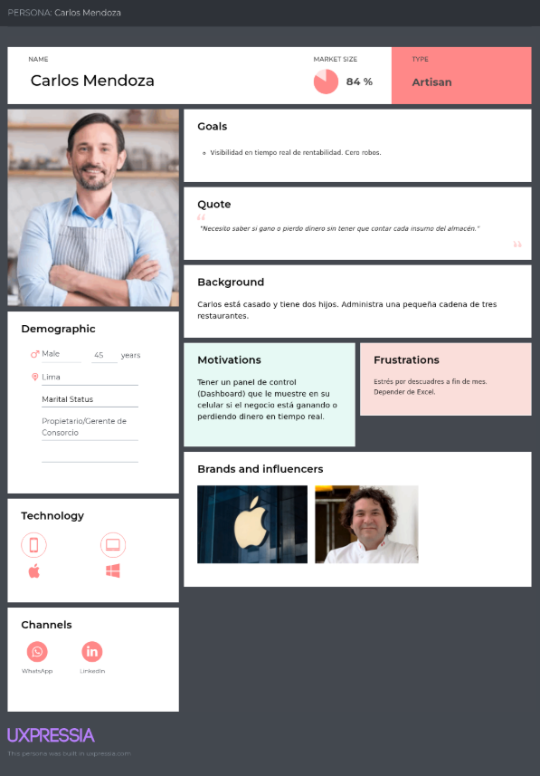

**User Persona 2: Miguel Rojas - El "Almacenero Frustrado" (Segmento 2)**
> *"Si registrar un ingreso fuera tan fácil como subir un TikTok, saldría temprano a casa."*
* **Gains:** Desea un sistema extremadamente simple y un buscador inteligente.
* **Pains:** Hacer inventario de madrugada, perder hojas de despacho.

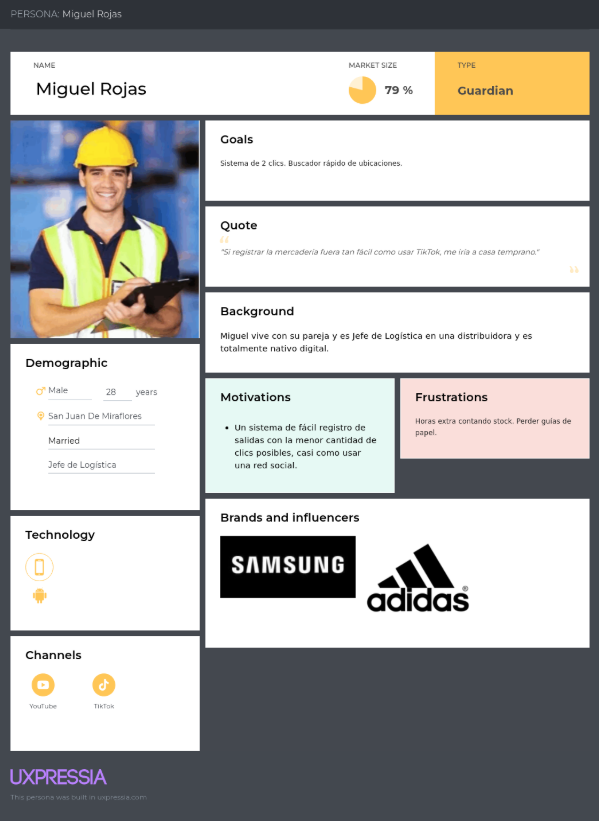

### 2.3.2. User Task Matrix

<table border="1" cellpadding="8" cellspacing="0" style="border-collapse: collapse; text-align: center; width: 100%;">
  <tr style="background-color:#f2f2f2;">
    <th rowspan="2">Task / Tarea</th>
    <th colspan="2">User Persona 1: Carlos (Dueño)</th>
    <th colspan="2">User Persona 2: Miguel (Almacenero)</th>
  </tr>
  <tr style="background-color:#f2f2f2;">
    <th>Frequency</th>
    <th>Importance</th>
    <th>Frequency</th>
    <th>Importance</th>
  </tr>
  <tr>
    <td style="text-align: left;">1. Registrar ingresos físicos de mercadería</td>
    <td>Baja</td>
    <td>Media</td>
    <td>Alta</td>
    <td>Alta</td>
  </tr>
  <tr>
    <td style="text-align: left;">2. Registrar salidas/despachos de mercadería</td>
    <td>Baja</td>
    <td>Media</td>
    <td>Alta</td>
    <td>Alta</td>
  </tr>
  <tr>
    <td style="text-align: left;">3. Buscar productos físicamente en estantes</td>
    <td>Rara vez</td>
    <td>Baja</td>
    <td>Alta</td>
    <td>Alta</td>
  </tr>
  <tr>
    <td style="text-align: left;">4. Calcular mermas / productos dañados</td>
    <td>Media</td>
    <td>Alta</td>
    <td>Media</td>
    <td>Media</td>
  </tr>
  <tr>
    <td style="text-align: left;">5. Elaborar cuadre financiero/inventario</td>
    <td>Media (Mensual)</td>
    <td>Alta</td>
    <td>Baja (a fin de mes)</td>
    <td>Alta</td>
  </tr>
  <tr>
    <td style="text-align: left;">6. Autorizar compras a proveedores</td>
    <td>Alta</td>
    <td>Alta</td>
    <td>Baja</td>
    <td>Baja</td>
  </tr>
  <tr>
    <td style="text-align: left;">7. Revisar estado general del negocio</td>
    <td>Alta (Diario)</td>
    <td>Alta</td>
    <td>Baja</td>
    <td>Baja</td>
  </tr>
</table>

 
**Análisis de la Matriz:**
La matriz evidencia que Miguel requiere interfaces móviles hiper-optimizadas para rapidez en tareas frecuentes (ingresos/salidas), mientras que Carlos requiere un Dashboard gerencial como pantalla principal para revisar el estado general. Ambos sufren con el cuadre de inventario, por lo que automatizarlo es una prioridad arquitectónica para CeTe.

### 2.3.3. User Journey Mapping

**Segmento 1: Oportunidad Carlos** (Automatizar la consolidación de datos y ofrecer Dashboard).

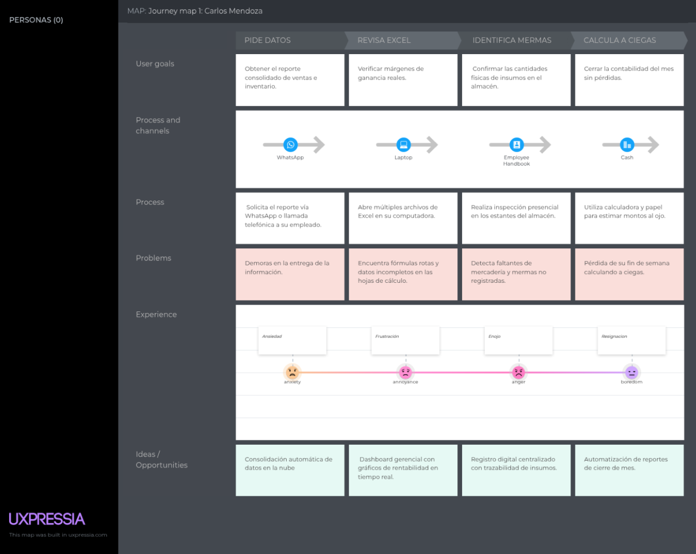

**Segmento 2: Oportunidad Miguel** (Reemplazar cuaderno por app móvil y buscador inteligente).

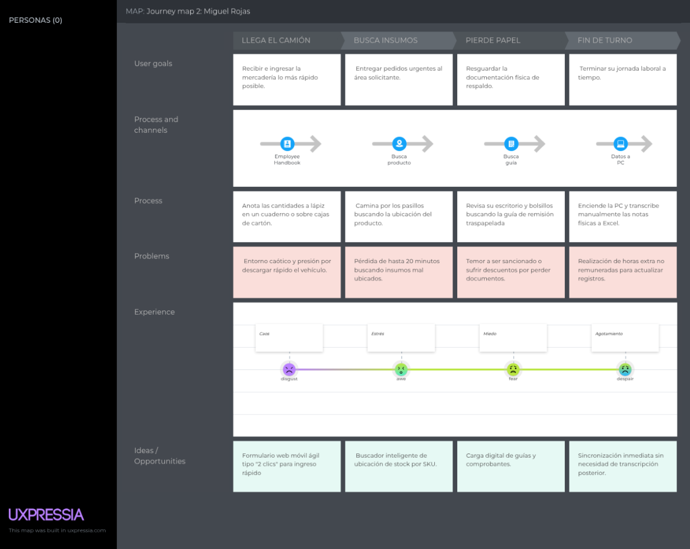

### 2.3.4. Empathy Mapping

**Empathy Map: Carlos Mendoza (Tomador de Decisión)**

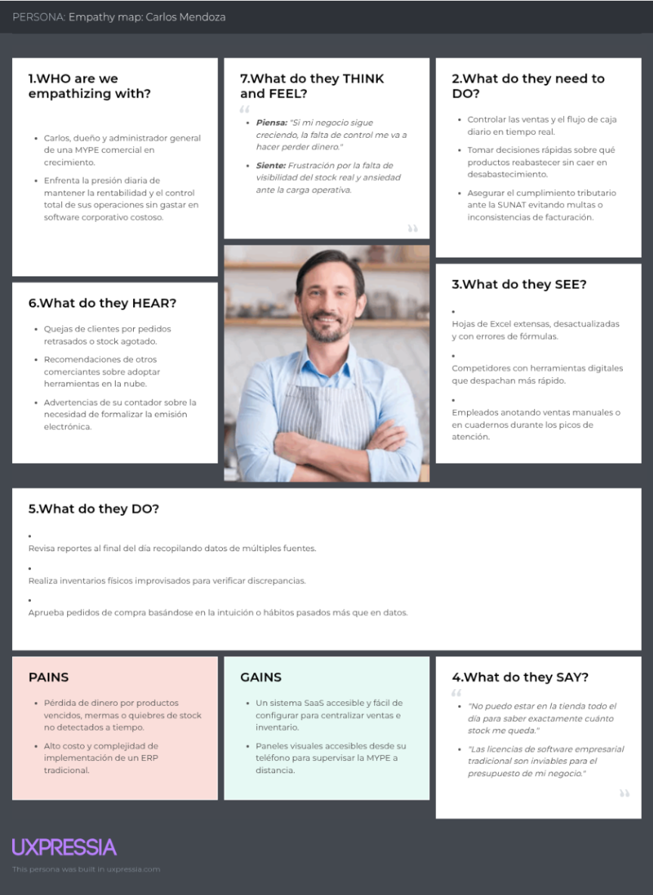

**Empathy Map: Miguel Rojas (Usuario Final)**

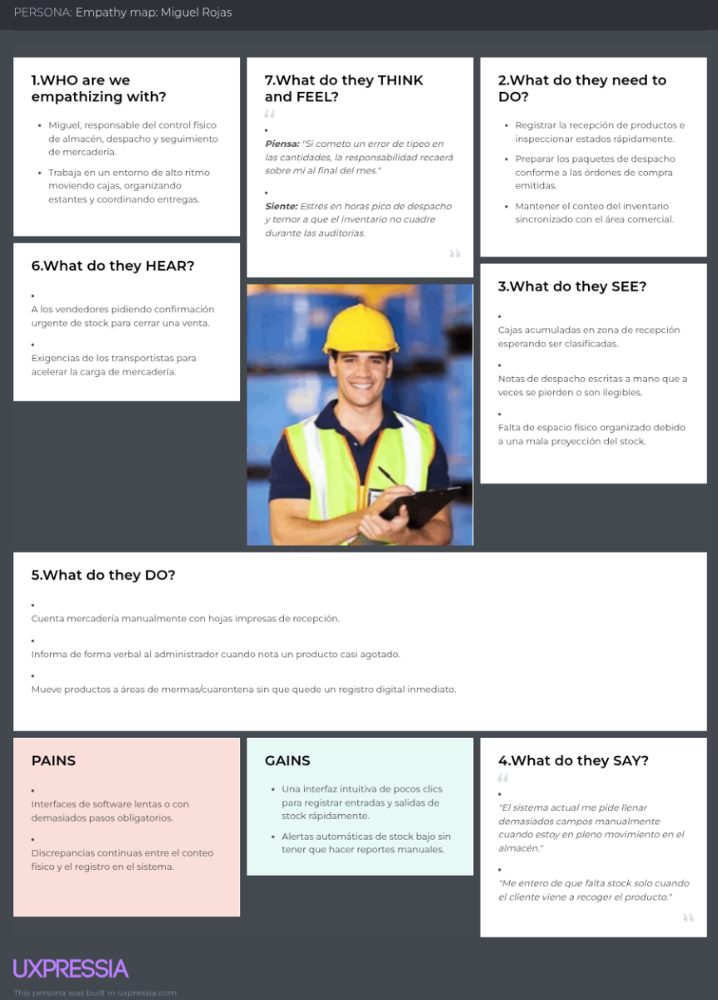

## 2.4. Big Picture EventStorming

En la sesión de Big Picture EventStorming, el equipo exploró de manera colaborativa y visual la línea de tiempo completa del negocio logístico utilizando FigJam, desde la recepción de mercadería hasta la facturación final.

* **Fase de Abastecimiento:** Se mapearon eventos críticos como `MerchandiseReceived`, `InventoryUpdated` y `LowStockAlertTriggered`.
* **Fase Comercial:** Se identificaron hitos transaccionales como `PurchaseOrderPlaced` y `InvoiceGenerated`.
* **Oportunidades Estratégicas:** El análisis visual reveló que el mayor cuello de botella y acumulación de fricción ocurre porque la información del estado físico del almacén no fluye en tiempo real hacia el área de ventas. La plataforma CeTe actuará como el puente digital que sincronice estos eventos de manera automatizada.

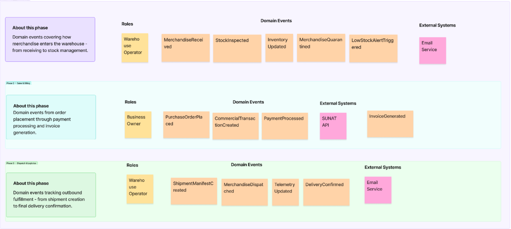

## 2.5. Ubiquitous Language

Para asegurar una comunicación sin ambigüedades entre los expertos del negocio y el equipo de desarrollo, hemos construido nuestro **Lenguaje Ubicuo (Ubiquitous Language)**. Este glosario estandariza los términos centrales del dominio logístico en todos los artefactos y el código fuente:

* **Inventory Item (Artículo de Inventario):** Producto físico o insumo que se encuentra almacenado dentro del negocio, listo para ser despachado o vendido.
* **SKU (Stock Keeping Unit):** Identificador alfanumérico único asignado a un artículo para rastrear su disponibilidad exacta.
* **Shipment Manifest (Manifiesto de Despacho):** Documento logístico consolidado que agrupa los artículos que saldrán del almacén.
* **Commercial Transaction (Transacción Comercial):** El registro oficial de una venta. Consolida los artículos adquiridos por el cliente y el estado del pago.
* **Quarantine (Cuarentena):** Estado temporal asignado a un artículo de inventario que presenta daños o dudas sobre su calidad, inhabilitando su venta.
* **Stock Out (Quiebre de Stock):** Situación crítica que ocurre cuando se intenta vender o utilizar un artículo cuya cantidad física en el almacén ha llegado a cero.

# Capítulo III: Requirements Specification

Esta sección consolida la especificación de los requisitos de software que darán vida a CeTe. Para garantizar un desarrollo ágil y centrado en el valor, todo el equipo ha colaborado en la redacción de Epics e Historias de Usuario aplicando estrictamente el acrónimo **INVEST**. Los criterios de aceptación han sido redactados en formato Gherkin (Given-When-Then).

## 3.1. User Stories

En esta sección se especifican los requisitos del sistema CeTe mediante un conjunto de Epics, User Stories y Technical Stories derivadas del proceso de *needfinding*, el análisis competitivo y los segmentos objetivo identificados. Las User Stories representan funcionalidades de valor para los usuarios finales de la plataforma web y del *landing page*, mientras que las Technical Stories describen los requisitos funcionales del RESTful API que soporta el sistema.

### EPICS

| Epic ID | Título | Descripción | Criterios de Aceptación | Relacionado con |
| :--- | :--- | :--- | :--- | :--- |
| **EPIC-01** | Autenticación y cuenta | **Como** usuario de CeTe, **deseo** gestionar el registro, inicio, cierre y recuperación de mi cuenta, **para** acceder de forma segura a la plataforma según mi plan. | **Escenario: Validación del alcance de autenticación y cuenta** **Given** que las historias US01, US02, US03 y US04 pertenecen a este epic, **When** el equipo evalúa el cumplimiento de EPIC-01, **Then** el epic se considera aceptado únicamente cuando las historias incluidas cumplen sus criterios de aceptación; el epic por sí solo no acredita implementación. | — |
| **EPIC-02** | Gestión de Inventario | **Como** operario de almacén, **deseo** gestionar las existencias, artículos y mermas, **para** mantener el stock actualizado y evitar descuadres físicos y lógicos. | **Escenario: Validación del alcance de gestión de inventario** **Given** que las historias US09, US10, US11, US12, US13 y US14 pertenecen a este epic, **When** el equipo evalúa el cumplimiento de EPIC-02, **Then** el epic se considera aceptado únicamente cuando dichas historias cumplen sus criterios y respetan las reglas lógicas del stock. | — |
| **EPIC-03** | Transacciones Comerciales | **Como** dueño de negocio, **deseo** gestionar el ciclo de vida de las ventas y transacciones diarias, **para** registrar los ingresos y descontar productos del almacén. | **Escenario: Validación del ciclo de vida de una transacción** **Given** que las historias US15, US16, US17 y US18 pertenecen a este epic, **When** el equipo valida EPIC-03, **Then** las operaciones respetan el flujo de ventas, impactan directamente en el inventario disponible y liberan o retornan stock si la venta es anulada. | — |
| **EPIC-04** | Logística y Despacho | **Como** jefe de logística, **deseo** gestionar guías, manifiestos de despacho e incidencias, **para** organizar la salida de mercadería y mantener la trazabilidad. | **Escenario: Validación de la gestión de despachos e incidencias** **Given** que las historias US19, US20, US21 y US22 pertenecen a este epic, **When** se registra un manifiesto o una incidencia en ruta, **Then** la información queda asociada a una venta verificada, es trazable y actualiza el estado logístico correctamente. | — |
| **EPIC-05** | Dashboard y Rentabilidad | **Como** dueño de negocio, **deseo** visualizar métricas clave y reportes en tiempo real, **para** localizar información financiera relevante y tomar decisiones. | **Escenario: Validación de reportes y dashboard** **Given** que las historias US23, US24 y US25 pertenecen a este epic, **When** el usuario consulta sus KPIs o exporta datos, **Then** el sistema devuelve únicamente información consolidada y autorizada que refleja el cruce exacto entre ventas e inventario. | — |
| **EPIC-06** | Notificaciones y Alertas | **Como** participante autorizado, **deseo** recibir notificaciones sobre stock mínimo y vencimientos, **para** reabastecer a tiempo sin monitorear manualmente cada producto. | **Escenario: Validación de notificaciones y alertas preventivas** **Given** que las historias US26 y US27 pertenecen a este epic, **When** ocurre un evento notificable como un quiebre de stock, **Then** el sistema genera avisos solo para los destinatarios autorizados y evita alertas duplicadas para el mismo evento. | — |
| **EPIC-07** | Roles y Permisos | **Como** administrador de la cuenta, **deseo** gestionar los accesos y crear usuarios empleados, **para** proteger la confidencialidad financiera de la empresa. | **Escenario: Validación de seguridad de roles** **Given** que las historias US28 y US29 pertenecen a este epic, **When** un usuario intenta acceder a un recurso, **Then** el epic exige que el sistema verifique el rol del usuario y deniegue o autorice el acceso a módulos específicos (ej. reportes). | — |
| **EPIC-08** | Perfil y preferencias | **Como** usuario registrado, **deseo** administrar mis datos de empresa, contraseña e idioma, **para** mantener mi cuenta actualizada y adaptar la interfaz. | **Escenario: Validación de perfil y preferencias** **Given** que las historias US30, US31 y US33 pertenecen a este epic, **When** el usuario modifica información permitida de su cuenta, **Then** el sistema valida los cambios, conserva las restricciones de seguridad y persiste las preferencias admitidas como el idioma. | — |
| **EPIC-09** | Landing page | **Como** visitante de CeTe, **deseo** conocer la propuesta, funcionalidades, testimonios y planes, **para** evaluar la solución antes de continuar a la plataforma. | **Escenario: Validación del contenido y navegación del landing page** **Given** que las historias US05, US06, US07, US08, US32 y US34 pertenecen a este epic, **When** el visitante navega por el landing page, **Then** el contenido es accesible, no presenta funciones proyectadas como implementadas y permite continuar el recorrido de registro. | — |

### USER STORIES and TECHNICAL STORIES

| Story ID | Título | Descripción | Criterios de Aceptación | Epic ID |
| :--- | :--- | :--- | :--- | :--- |
| **US01** | Registro de cuenta | **Como** visitante, **deseo** registrar los datos de mi empresa, **para** crear una cuenta administradora en CeTe. | **Escenario 1: Flujo esperado** **Given** datos válidos y un RUC no registrado, **When** solicita registro, **Then** se crea la cuenta administradora y se informa el siguiente paso.  **Escenario 2: Validación** **Given** un correo o RUC ya existente, **When** solicita registro, **Then** no se crea otra cuenta y se informa el error. | **EPIC-01** |
| **US02** | Inicio de sesión | **Como** usuario registrado, **deseo** autenticarme, **para** acceder al espacio de trabajo de mi empresa. | **Escenario 1: Flujo esperado** **Given** credenciales válidas, **When** solicita acceso, **Then** obtiene una sesión con su rol.  **Escenario 2: Validación** **Given** credenciales incorrectas, **When** solicita acceso, **Then** recibe un error genérico sin revelar la existencia de la cuenta. | **EPIC-01** |
| **US03** | Cierre de sesión | **Como** usuario autenticado, **deseo** terminar mi sesión, **para** proteger mi cuenta y la información del negocio. | **Escenario 1: Flujo esperado** **Given** una sesión vigente, **When** solicita cerrarla, **Then** la sesión queda invalidada y es redirigido.  **Escenario 2: Validación** **Given** una sesión ya cerrada, **When** solicita un recurso protegido, **Then** se rechaza el acceso. | **EPIC-01** |
| **US04** | Recuperación de contraseña | **Como** usuario registrado, **deseo** restablecer mi contraseña, **para** recuperar acceso si la he olvidado. | **Escenario 1: Flujo esperado** **Given** una solicitud con correo válido, **When** la procesa el sistema, **Then** devuelve confirmación genérica y envía enlace seguro.  **Escenario 2: Validación** **Given** un enlace vencido o utilizado, **When** intenta restablecer la contraseña, **Then** se rechaza el cambio. | **EPIC-01** |
| **US05** | Propuesta de valor en landing | **Como** visitante, **deseo** conocer la propuesta de valor de CeTe, **para** evaluar si soluciona mis problemas operativos. | **Escenario 1: Flujo esperado** **Given** acceso a la landing, **When** consulta la propuesta, **Then** identifica el problema logístico y la solución centralizada.  **Escenario 2: Validación** **Given** acceso desde móvil, **When** consulta la propuesta, **Then** el contenido conserva legibilidad y diseño responsivo. | **EPIC-09** |
| **US06** | Funcionalidades de landing | **Como** visitante, **deseo** conocer las capacidades del producto, **para** comprobar si cubre mis necesidades de negocio. | **Escenario 1: Flujo esperado** **Given** consulta de capacidades, **When** revisa su alcance, **Then** encuentra módulos de inventario, ventas y reportes descritos.  **Escenario 2: Validación** **Given** un usuario navegando, **When** hace clic en funcionalidad en construcción, **Then** el sistema informa que estará disponible próximamente. | **EPIC-09** |
| **US07** | Modelo comercial y planes | **Como** visitante, **deseo** consultar modalidades y planes de suscripción, **para** evaluar una posible contratación para mi MYPE. | **Escenario 1: Flujo esperado** **Given** modalidades publicadas, **When** las consulta, **Then** distingue límites de usuarios y costos.  **Escenario 2: Validación** **Given** selección de un plan, **When** continúa el flujo, **Then** es dirigido al registro con plan preseleccionado sin ejecutar cobros inmediatos. | **EPIC-09** |
| **US08** | Contacto B2B | **Como** visitante corporativo, **deseo** enviar un mensaje a ventas, **para** solicitar una demostración personalizada. | **Escenario 1: Flujo esperado** **Given** datos de contacto válidos, **When** envía el formulario, **Then** confirma el envío y notifica al equipo.  **Escenario 2: Validación** **Given** un correo con formato inválido, **When** intenta enviar, **Then** resalta el error y bloquea el envío. | **EPIC-09** |
| **US09** | Registro de Artículo (SKU) | **Como** operario, **deseo** dar de alta un nuevo producto, **para** que esté disponible para futuras transacciones. | **Escenario 1: Flujo esperado** **Given** datos válidos, **When** guarda el registro, **Then** el artículo se crea con stock inicial 0.  **Escenario 2: Validación** **Given** un SKU ya existente, **When** intenta registrarlo, **Then** se rechaza la duplicación en la empresa. | **EPIC-02** |
| **US10** | Ingreso de Mercadería | **Como** operario, **deseo** sumar unidades físicas a un SKU existente, **para** reflejar el abastecimiento del almacén. | **Escenario 1: Flujo esperado** **Given** cantidad positiva, **When** registra la entrada, **Then** el stock total del SKU se incrementa atómicamente.  **Escenario 2: Validación** **Given** cantidad negativa o nula, **When** intenta registrar, **Then** se impide la transacción. | **EPIC-02** |
| **US11** | Salida Manual de Mercadería | **Como** operario, **deseo** registrar el retiro manual de productos, **para** reflejar consumos internos o ajustes. | **Escenario 1: Flujo esperado** **Given** stock suficiente y motivo válido, **When** registra la salida, **Then** el inventario disminuye.  **Escenario 2: Validación** **Given** retiro mayor al stock, **When** solicita la acción, **Then** emite alerta de insuficiencia. | **EPIC-02** |
| **US12** | Registro de Mermas | **Como** operario, **deseo** apartar productos dañados o caducados, **para** evitar que sean vendidos por error. | **Escenario 1: Flujo esperado** **Given** producto en mal estado, **When** lo marca como merma, **Then** se descuenta del stock y se registra como pérdida.  **Escenario 2: Validación** **Given** producto marcado como merma, **When** consulta Dashboard, **Then** el costo impacta negativamente la rentabilidad. | **EPIC-02** |
| **US13** | Buscador de Inventario | **Como** operario, **deseo** buscar productos por nombre o SKU, **para** localizarlos rápidamente sin listas largas. | **Escenario 1: Flujo esperado** **Given** término coincidente, **When** ingresa al menos 3 caracteres, **Then** filtra la tabla en tiempo real.  **Escenario 2: Validación** **Given** término sin coincidencias, **When** busca, **Then** obtiene resultado vacío sin errores. | **EPIC-02** |
| **US14** | Historial de Movimientos | **Como** participante autorizado, **deseo** ver el Kardex de un producto, **para** auditar discrepancias o mermas. | **Escenario 1: Flujo esperado** **Given** SKU con movimientos, **When** consulta historial, **Then** obtiene lista cronológica.  **Escenario 2: Validación** **Given** producto recién creado, **When** consulta historial, **Then** tabla vacía sin error. | **EPIC-02** |
| **US15** | Creación de Venta | **Como** dueño o vendedor, **deseo** registrar una transacción comercial, **para** formalizar ingresos y descontar stock. | **Escenario 1: Flujo esperado** **Given** productos con stock, **When** procesa venta, **Then** genera registro y descuenta productos simultáneamente.  **Escenario 2: Validación** **Given** problemas de conexión, **When** transacción falla, **Then** aplica rollback y no descuenta inventario. | **EPIC-03** |
| **US16** | Validación Automática de Stock | **Como** vendedor, **deseo** bloqueo de productos agotados en caja, **para** no prometer mercadería inexistente. | **Escenario 1: Flujo esperado** **Given** producto con stock cero, **When** intenta añadirlo, **Then** botón se deshabilita preventivamente.  **Escenario 2: Validación** **Given** 5 unidades y venta de 6, **When** ingresa cantidad, **Then** alerta exceso y ajusta al máximo. | **EPIC-03** |
| **US17** | Historial de Ventas | **Como** participante autorizado, **deseo** consultar transacciones pasadas, **para** llevar el control de ingresos diarios. | **Escenario 1: Flujo esperado** **Given** ventas registradas, **When** consulta módulo, **Then** las obtiene ordenadas por fecha.  **Escenario 2: Validación** **Given** filtro de fechas invertido, **When** intenta aplicar, **Then** solicita corregir el rango. | **EPIC-03** |
| **US18** | Anulación de Venta | **Como** dueño, **deseo** revertir una venta equivocada, **para** corregir métricas y devolver stock. | **Escenario 1: Flujo esperado** **Given** venta completada, **When** solicita anulación, **Then** estado pasa a "Anulada" y stock se reintegra atómicamente.  **Escenario 2: Validación** **Given** venta ya anulada, **When** intenta anularla, **Then** bloquea acción para evitar duplicidad. | **EPIC-03** |
| **US19** | Manifiesto de Despacho | **Como** logístico, **deseo** agrupar ventas en un manifiesto, **para** ordenar la ruta de entrega. | **Escenario 1: Flujo esperado** **Given** ventas pendientes, **When** selecciona y crea manifiesto, **Then** se genera documento consolidado.  **Escenario 2: Validación** **Given** ventas ya despachadas, **When** intenta agruparlas, **Then** el sistema las oculta o bloquea. | **EPIC-04** |
| **US20** | Asignación de Conductor | **Como** logístico, **deseo** vincular recursos al manifiesto, **para** establecer responsables de entrega. | **Escenario 1: Flujo esperado** **Given** manifiesto y recursos disponibles, **When** asigna chofer y placa, **Then** datos quedan vinculados al despacho.  **Escenario 2: Validación** **Given** chofer ocupado, **When** intenta asignarlo, **Then** advierte sobre superposición. | **EPIC-04** |
| **US21** | Actualización de Estado | **Como** logístico, **deseo** cambiar el estado del envío, **para** notificar su entrega efectiva. | **Escenario 1: Flujo esperado** **Given** despacho "En Ruta", **When** lo marca "Entregado", **Then** ventas asociadas finalizan su ciclo.  **Escenario 2: Validación** **Given** estado ilógico, **When** intenta retroceder, **Then** impide la transición. | **EPIC-04** |
| **US22** | Incidencia en Ruta | **Como** logístico, **deseo** anotar contratiempos logísticos, **para** auditar retrasos en entregas. | **Escenario 1: Flujo esperado** **Given** despacho activo, **When** reporta incidente, **Then** nota queda vinculada a la ruta.  **Escenario 2: Validación** **Given** ruta sin eventos, **When** consulta incidencias, **Then** vista limpia sin errores. | **EPIC-04** |
| **US23** | Dashboard General | **Como** dueño, **deseo** ver gráficos consolidados, **para** entender la salud financiera en tiempo real. | **Escenario 1: Flujo esperado** **Given** datos financieros activos, **When** carga dashboard, **Then** visualiza KPIs de ingresos y valorización.  **Escenario 2: Validación** **Given** negocio sin datos, **When** carga panel, **Then** gráficos vacíos con invitaciones. | **EPIC-05** |
| **US24** | Reporte de Top Productos | **Como** dueño, **deseo** identificar los artículos más vendidos, **para** priorizar abastecimiento. | **Escenario 1: Flujo esperado** **Given** ventas en el mes, **When** consulta ranking, **Then** obtiene lista descendente precisa.  **Escenario 2: Validación** **Given** empate en ventas, **When** genera reporte, **Then** comparten posición alfabéticamente. | **EPIC-05** |
| **US25** | Exportación de Datos | **Como** participante autorizado, **deseo** descargar mis tablas a CSV, **para** enviarlas a contabilidad. | **Escenario 1: Flujo esperado** **Given** tabla filtrada en pantalla, **When** hace clic en exportar, **Then** descarga CSV respetando filtro activo.  **Escenario 2: Validación** **Given** tabla vacía, **When** intenta exportar, **Then** archivo contiene solo cabeceras. | **EPIC-05** |
| **US26** | Alerta de Stock Mínimo | **Como** participante autorizado, **deseo** recibir avisos al acercarme a cero, **para** reponer mercadería a tiempo. | **Escenario 1: Flujo esperado** **Given** SKU con límite configurado, **When** stock perfora límite, **Then** dispara alerta visual.  **Escenario 2: Validación** **Given** alerta ya enviada, **When** stock baja más, **Then** no duplica notificación. | **EPIC-06** |
| **US27** | Alerta de Producto Vencido | **Como** almacenero, **deseo** avisos preventivos de caducidad, **para** ofertar artículos perecibles. | **Escenario 1: Flujo esperado** **Given** lotes con caducidad, **When** alcanza umbral de 7 días, **Then** artículos se resaltan en rojo.  **Escenario 2: Validación** **Given** producto ya vencido, **When** intenta vender, **Then** emite doble alerta de confirmación. | **EPIC-06** |
| **US28** | Creación de Usuarios | **Como** administrador, **deseo** crear cuentas para mis trabajadores, **para** delegar accesos seguros. | **Escenario 1: Flujo esperado** **Given** correo nuevo y rol elegido, **When** envía invitación, **Then** empleado recibe acceso.  **Escenario 2: Validación** **Given** correo que ya pertenece a la empresa, **When** intenta agregarlo, **Then** indica que el usuario ya existe. | **EPIC-07** |
| **US29** | Restricción por Roles | **Como** administrador, **deseo** definir niveles de acceso operacionales, **para** bloquear módulos confidenciales. | **Escenario 1: Flujo esperado** **Given** usuario con rol almacenero, **When** navega por menú, **Then** no visualiza enlace a reportes.  **Escenario 2: Validación** **Given** intento de acceso directo por URL a recurso prohibido, **When** ejecuta petición, **Then** API devuelve 403 Forbidden. | **EPIC-07** |
| **US30** | Edición de Perfil Empresa | **Como** administrador, **deseo** actualizar mis datos comerciales, **para** mantener facturas e interfaz personalizadas. | **Escenario 1: Flujo esperado** **Given** datos válidos, **When** guarda actualización, **Then** header refleja cambios.  **Escenario 2: Validación** **Given** intento de modificar RUC base, **When** guarda, **Then** bloquea acción por seguridad fiscal. | **EPIC-08** |
| **US31** | Cambio de Contraseña | **Como** usuario registrado, **deseo** actualizar mi clave, **para** asegurar mi cuenta. | **Escenario 1: Flujo esperado** **Given** clave actual correcta y nueva válida, **When** confirma cambio, **Then** actualiza y cierra otras sesiones activas.  **Escenario 2: Validación** **Given** contraseña actual incorrecta, **When** intenta cambiarla, **Then** rechaza la acción. | **EPIC-08** |
| **US32** | Testimonios (Landing) | **Como** visitante, **deseo** consultar experiencias de otras MYPES, **para** ganar confianza. | **Escenario 1: Flujo esperado** **Given** testimonios aprobados, **When** hace scroll, **Then** visualiza tarjetas.  **Escenario 2: Validación** **Given** fallo de conexión, **When** carga testimonios, **Then** se oculta elegantemente. | **EPIC-09** |
| **US33** | Idioma de la aplicación | **Como** usuario, **deseo** elegir inglés o español, **para** comprender la interfaz a mi gusto. | **Escenario 1: Flujo esperado** **Given** selector de idioma, **When** elige "English", **Then** textos estáticos se traducen al instante.  **Escenario 2: Validación** **Given** contenido ingresado por usuario, **When** cambia idioma, **Then** dicho texto no se altera. | **EPIC-08** |
| **US34** | Términos del Servicio | **Como** visitante, **deseo** leer las condiciones legales, **para** conocer el uso de mi data. | **Escenario 1: Flujo esperado** **Given** enlace en el footer, **When** hace clic, **Then** despliega políticas.  **Escenario 2: Validación** **Given** lectura en móvil, **When** abre términos, **Then** texto es totalmente responsivo y legible. | **EPIC-09** |
| **TS01** | POST /api/v1/auth/register | **Como** Developer, **deseo** disponer de este contrato **para** soportar US01. | **Escenario 1: Flujo esperado** **Given** solicitud válida, **When** servidor procesa, **Then** responde 201 Created con ID del tenant.  **Escenario 2: Validación** **Given** condición inválida, **When** procesa, **Then** responde 409 si correo duplicado o 400 faltan datos. | **EPIC-01** |
| **TS02** | POST /api/v1/auth/login | **Como** Developer, **deseo** disponer de este contrato **para** soportar US02. | **Escenario 1: Flujo esperado** **Given** solicitud con credenciales válidas, **When** servidor procesa, **Then** responde 200 OK con accessToken.  **Escenario 2: Validación** **Given** credenciales erróneas, **When** procesa, **Then** responde 401 genérico. | **EPIC-01** |
| **TS03** | POST /api/v1/auth/logout | **Como** Developer, **deseo** disponer de este contrato **para** soportar US03. | **Escenario 1: Flujo esperado** **Given** solicitud con token vigente, **When** servidor procesa, **Then** responde 204 No Content e invalida sesión.  **Escenario 2: Validación** **Given** intento posterior con misma sesión, **When** procesa, **Then** responde 401 Unauthorized. | **EPIC-01** |
| **TS04** | POST /api/v1/auth/password-reset | **Como** Developer, **deseo** disponer de este contrato **para** soportar US04. | **Escenario 1: Flujo esperado** **Given** solicitud válida, **When** servidor procesa, **Then** responde 202 Accepted genérico.  **Escenario 2: Validación** **Given** solicitudes masivas, **When** procesa, **Then** limita reintentos por rate limiting. | **EPIC-01** |
| **TS05** | GET /api/v1/inventory | **Como** Developer, **deseo** disponer de este contrato **para** soportar vistas generales. | **Escenario 1: Flujo esperado** **Given** solicitud válida y autorizada, **When** servidor procesa, **Then** responde 200 OK con data paginada.  **Escenario 2: Validación** **Given** falta de token, **When** procesa, **Then** responde 401 Unauthorized. | **EPIC-02** |
| **TS06** | POST /api/v1/inventory | **Como** Developer, **deseo** disponer de este contrato **para** soportar US09. | **Escenario 1: Flujo esperado** **Given** payload válido, **When** servidor procesa, **Then** responde 201 Created validando esquemas.  **Escenario 2: Validación** **Given** SKU duplicado, **When** procesa, **Then** responde 409 Conflict. | **EPIC-02** |
| **TS07** | POST /api/v1/inventory/{sku}/entries | **Como** Developer, **deseo** disponer de este contrato **para** soportar US10. | **Escenario 1: Flujo esperado** **Given** cantidad positiva, **When** servidor procesa, **Then** responde 201 sumando stock atómicamente.  **Escenario 2: Validación** **Given** SKU inexistente, **When** procesa, **Then** responde 404 Not Found. | **EPIC-02** |
| **TS08** | POST /api/v1/inventory/{sku}/exits | **Como** Developer, **deseo** disponer de este contrato **para** soportar US11 y US12. | **Escenario 1: Flujo esperado** **Given** cantidad a retirar y stock suficiente, **When** servidor procesa, **Then** responde 201 descontando stock.  **Escenario 2: Validación** **Given** cantidad supera stock, **When** procesa, **Then** responde 422 Unprocessable Entity. | **EPIC-02** |
| **TS09** | GET /api/v1/inventory/{sku}/history | **Como** Developer, **deseo** disponer de este contrato **para** soportar US14. | **Escenario 1: Flujo esperado** **Given** solicitud de historial, **When** servidor procesa, **Then** responde 200 OK con movimientos cronológicos.  **Escenario 2: Validación** **Given** condición inválida, **When** procesa, **Then** responde 404 si SKU no pertenece al tenant. | **EPIC-02** |
| **TS10** | GET /api/v1/sales | **Como** Developer, **deseo** disponer de este contrato **para** soportar US17. | **Escenario 1: Flujo esperado** **Given** solicitud válida con fechas, **When** servidor procesa, **Then** responde 200 OK con transacciones.  **Escenario 2: Validación** **Given** fechas invertidas, **When** procesa, **Then** responde 400 Bad Request. | **EPIC-03** |
| **TS11** | POST /api/v1/sales | **Como** Developer, **deseo** disponer de este contrato **para** soportar US15. | **Escenario 1: Flujo esperado** **Given** líneas de detalle válidas, **When** servidor procesa, **Then** responde 201 Created con transacción atómica.  **Escenario 2: Validación** **Given** quiebre de stock en un SKU, **When** procesa, **Then** ejecuta Rollback total y devuelve 422. | **EPIC-03** |
| **TS12** | GET /api/v1/sales/{id} | **Como** Developer, **deseo** disponer de este contrato **para** soportar detalle de venta. | **Escenario 1: Flujo esperado** **Given** solicitud de ID, **When** servidor procesa, **Then** responde 200 OK con ítems asociados.  **Escenario 2: Validación** **Given** venta de otro tenant, **When** procesa, **Then** responde 403 Forbidden. | **EPIC-03** |
| **TS13** | PATCH /api/v1/sales/{id}/cancel | **Como** Developer, **deseo** disponer de este contrato **para** soportar US18. | **Escenario 1: Flujo esperado** **Given** solicitud de anulación válida, **When** servidor procesa, **Then** responde 200 OK reintegrando inventario.  **Escenario 2: Validación** **Given** venta ya anulada, **When** procesa, **Then** responde 409 Conflict. | **EPIC-03** |
| **TS14** | GET /api/v1/dispatches | **Como** Developer, **deseo** disponer de este contrato **para** soportar vistas de despacho. | **Escenario 1: Flujo esperado** **Given** solicitud de listado, **When** servidor procesa, **Then** responde 200 OK con manifiestos paginados.  **Escenario 2: Validación** **Given** ausencia de token, **When** procesa, **Then** responde 401 Unauthorized. | **EPIC-04** |
| **TS15** | POST /api/v1/dispatches | **Como** Developer, **deseo** disponer de este contrato **para** soportar US19. | **Escenario 1: Flujo esperado** **Given** array de IDs de ventas, **When** servidor procesa, **Then** responde 201 Created asociando las ventas.  **Escenario 2: Validación** **Given** ventas que ya tienen despacho, **When** procesa, **Then** responde 400 Bad Request. | **EPIC-04** |
| **TS16** | PATCH /api/v1/dispatches/{id}/status | **Como** Developer, **deseo** disponer de este contrato **para** soportar US21. | **Escenario 1: Flujo esperado** **Given** nuevo estado válido, **When** servidor procesa, **Then** responde 200 OK transicionando entidades.  **Escenario 2: Validación** **Given** transición ilógica, **When** procesa, **Then** responde 409 Conflict. | **EPIC-04** |
| **TS17** | POST /api/v1/dispatches/{id}/incidents | **Como** Developer, **deseo** disponer de este contrato **para** soportar US22. | **Escenario 1: Flujo esperado** **Given** payload de reporte en ruta, **When** servidor procesa, **Then** responde 201 Created vinculando la nota.  **Escenario 2: Validación** **Given** payload vacío, **When** procesa, **Then** responde 400 Bad Request. | **EPIC-04** |
| **TS18** | GET /api/v1/analytics/dashboard | **Como** Developer, **deseo** disponer de este contrato **para** soportar US23 y US24. | **Escenario 1: Flujo esperado** **Given** rango de fechas válido, **When** servidor procesa, **Then** ejecuta query agregada y retorna 200 OK con KPIs.  **Escenario 2: Validación** **Given** rango inválido, **When** procesa, **Then** responde 400 Bad Request. | **EPIC-05** |
| **TS19** | GET /api/v1/notifications | **Como** Developer, **deseo** disponer de este contrato **para** soportar alertas de sistema. | **Escenario 1: Flujo esperado** **Given** solicitud autorizada, **When** servidor procesa, **Then** responde 200 OK con array de alertas no leídas.  **Escenario 2: Validación** **Given** sin sesión, **When** procesa, **Then** responde 401 Unauthorized sin cruzar datos. | **EPIC-06** |
| **TS20** | PATCH /api/v1/notifications/{id}/read | **Como** Developer, **deseo** disponer de este contrato **para** marcar alertas leídas. | **Escenario 1: Flujo esperado** **Given** ID de alerta válido, **When** servidor procesa, **Then** responde 200 OK actualizando isRead.  **Escenario 2: Validación** **Given** alerta ajena, **When** procesa, **Then** responde 404 Not Found. | **EPIC-06** |
| **TS21** | GET /api/v1/users | **Como** Developer, **deseo** disponer de este contrato **para** soportar la vista de equipo. | **Escenario 1: Flujo esperado** **Given** solicitud de un Admin, **When** servidor procesa, **Then** responde 200 OK con lista de empleados del tenant.  **Escenario 2: Validación** **Given** solicitud de Almacenero, **When** procesa, **Then** responde 403 Forbidden. | **EPIC-07** |
| **TS22** | POST /api/v1/users/invite | **Como** Developer, **deseo** disponer de este contrato **para** soportar US28. | **Escenario 1: Flujo esperado** **Given** payload de invitación válido, **When** servidor procesa, **Then** responde 201 Created disparando correo.  **Escenario 2: Validación** **Given** correo existente en tenant, **When** procesa, **Then** responde 409 Conflict. | **EPIC-07** |
| **TS23** | GET /api/v1/users/profile | **Como** Developer, **deseo** disponer de este contrato **para** cargar la vista de cuenta. | **Escenario 1: Flujo esperado** **Given** solicitud válida, **When** servidor procesa, **Then** responde 200 OK con datos personales e idioma.  **Escenario 2: Validación** **Given** condición inválida, **When** procesa, **Then** responde 401 sin sesión válida. | **EPIC-08** |
| **TS24** | PUT /api/v1/users/profile | **Como** Developer, **deseo** disponer de este contrato **para** soportar US30. | **Escenario 1: Flujo esperado** **Given** datos editables válidos, **When** servidor procesa, **Then** responde 200 OK persistiendo cambios.  **Escenario 2: Validación** **Given** payload inyectando cambio de rol, **When** procesa, **Then** ignora el campo o responde 400 Bad Request. | **EPIC-08** |
| **TS25** | PUT /api/v1/users/password | **Como** Developer, **deseo** disponer de este contrato **para** soportar US31. | **Escenario 1: Flujo esperado** **Given** claves correctas, **When** servidor procesa, **Then** responde 204 No Content hasheando y guardando.  **Escenario 2: Validación** **Given** hash actual incorrecto, **When** procesa, **Then** responde 400 Bad Request sin alterar credenciales. | **EPIC-08** |
| **TS26** | POST /api/v1/contact-messages | **Como** Developer, **deseo** disponer de este contrato **para** soportar US08. | **Escenario 1: Flujo esperado** **Given** formulario público válido, **When** servidor procesa, **Then** responde 201 Created guardando solicitud.  **Escenario 2: Validación** **Given** ataques por bots, **When** procesa, **Then** devuelve 429 Too Many Requests. | **EPIC-09** |
| **TS27** | GET /api/v1/landing/plans | **Como** Developer, **deseo** disponer de este contrato **para** soportar US07. | **Escenario 1: Flujo esperado** **Given** petición pública a la landing, **When** servidor procesa, **Then** responde 200 OK renderizando planes actuales.  **Escenario 2: Validación** **Given** error de conectividad interna, **When** procesa, **Then** responde 500 Internal Server Error seguro. | **EPIC-09** |

## 3.2. Impact Mapping

En esta sección se presenta el Impact Mapping del modelo de negocio CeTe. Esto nos permite visualizar de manera estructurada los objetivos estratégicos del proyecto y cómo estos se relacionan con los actores involucrados y las funcionalidades que se implementarán, asegurándonos de que cada característica del producto tenga un propósito claro y medible.

  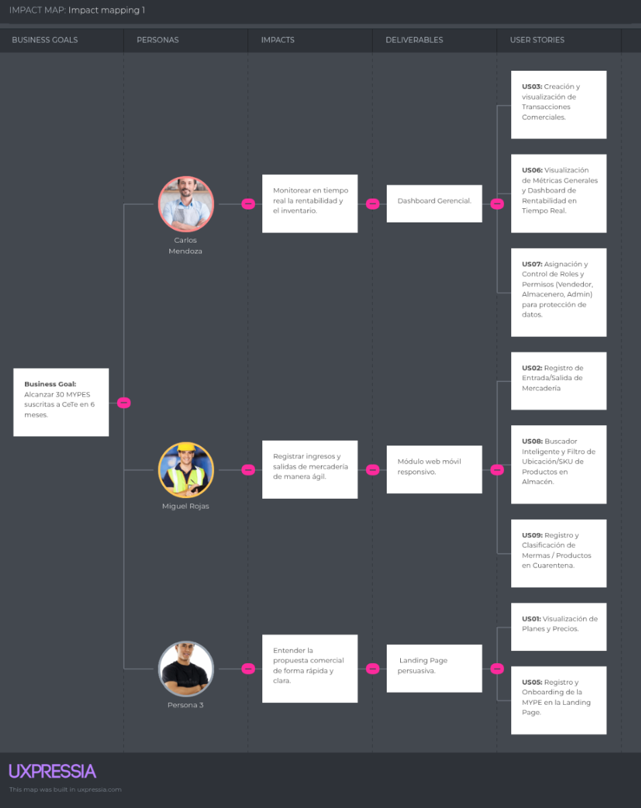
   <em>Figura 1: Captura del Impact Mapping hecho en UXPressia</em>

El Impact Mapping elaborado para CeTe ilustra de manera estratégica cómo las funcionalidades de nuestra plataforma tecnológica contribuyen a alcanzar nuestros objetivos de negocio. Para esta fase del proyecto, hemos definido un objetivo SMART (Business Goal) enfocado tanto en la adopción empresarial como en la penetración en el usuario final.

**Alineación del Business Goal 1:** Alcanzar 30 negocios (MYPES) suscritos a los planes de pago de CeTe en los primeros 6 meses tras el lanzamiento oficial de la plataforma. Para alcanzar esta meta, hemos identificado a tres actores clave del sector comercial que nos permitirán materializarla: los dueños/administradores de negocio, el personal logístico/almaceneros y los visitantes potenciales.
- En el caso de los dueños/administradores de negocio, el impacto que necesitamos generar es que monitoreen la salud y rentabilidad de su empresa en tiempo real, dejando atrás la incertidumbre de no saber dónde está su mercadería o si están ganando dinero. Como solución digital, provocaremos este impacto construyendo un Dashboard Gerencial y Analítico (Deliverable), el cual se materializa en historias de usuario enfocadas en consolidar métricas financieras, visualizar top de ventas y gestionar los roles de acceso (US23, US24, US25, US28, US29).
- Por el lado del personal logístico/almaceneros, el impacto esperado es que adopten CeTe como su canal centralizado para registrar ingresos y salidas, abandonando totalmente los conteos manuales y reportes en cuadernos. Para facilitar este comportamiento, implementaremos un Módulo de Inventario Inteligente (Deliverable), soportado por funcionalidades que permiten registrar entradas y mermas en segundos, buscar artículos ágilmente y generar notificaciones automáticas de stock mínimo y vencimientos (US09, US10, US11, US12, US13, US14, US26, US27).
- En cuanto a los visitantes MYPE, el impacto deseado es la comprensión rápida de la propuesta de valor para motivarlos a suscribirse. Para ello, implementaremos un Landing Page persuasivo (Deliverable), soportado por historias para visualizar planes, testimonios y el formulario de registro (US05, US06, US07, US08, US32, US34).

## 3.3. Product Backlog

A continuación, se presenta el Product Backlog del proyecto CeTe, organizado y priorizado de acuerdo con el valor que cada User Story aporta al negocio y al funcionamiento principal del producto. La priorización no representa necesariamente el orden exacto en el que se desarrollarán técnicamente las funcionalidades, sino el nivel de importancia que tienen para validar y entregar valor al usuario.

| # Orden | Story ID | Título | Descripción | Story Points |
| :---: | :---: | :--- | :--- | :---: |
| 1 | US05 | Propuesta de valor en landing | Como visitante, deseo conocer la propuesta de valor de CeTe, para evaluar si soluciona mis problemas operativos. | 2 |
| 2 | US06 | Funcionalidades de landing | Como visitante, deseo conocer las capacidades del producto, para comprobar si cubre mis necesidades de negocio. | 2 |
| 3 | US07 | Modelo comercial y planes | Como visitante, deseo consultar modalidades y planes de suscripción, para evaluar una posible contratación para mi MYPE. | 2 |
| 4 | US34 | Términos del Servicio | Como visitante, deseo leer las condiciones legales, para conocer el uso de mi data. | 2 |
| 5 | US09 | Registro de Artículo (SKU) | Como operario, deseo dar de alta un nuevo producto, para que esté disponible para futuras transacciones. | 3 |
| 6 | US10 | Ingreso de Mercadería | Como operario, deseo sumar unidades físicas a un SKU existente, para reflejar el abastecimiento del almacén. | 5 |
| 7 | US13 | Buscador de Inventario | Como operario, deseo buscar productos por nombre o SKU, para localizarlos rápidamente sin listas largas. | 3 |
| 8 | US11 | Salida Manual de Mercadería | Como operario, deseo registrar el retiro manual de productos, para reflejar consumos internos o ajustes. | 3 |
| 9 | US15 | Creación de Venta | Como dueño o vendedor, deseo registrar una transacción comercial, para formalizar ingresos y descontar stock. | 8 |
| 10 | US16 | Validación Automática de Stock | Como vendedor, deseo bloqueo de productos agotados en caja, para no prometer mercadería inexistente. | 5 |
| 11 | US23 | Dashboard General | Como dueño, deseo ver gráficos consolidados, para entender la salud financiera en tiempo real. | 8 |
| 12 | US19 | Manifiesto de Despacho | Como logístico, deseo agrupar ventas en un manifiesto, para ordenar la ruta de entrega. | 5 |
| 13 | US21 | Actualización de Estado | Como logístico, deseo cambiar el estado del envío, para notificar su entrega efectiva. | 3 |
| 14 | US14 | Historial de Movimientos | Como participante autorizado, deseo ver el Kardex de un producto, para auditar discrepancias o mermas. | 3 |
| 15 | US17 | Historial de Ventas | Como participante autorizado, deseo consultar transacciones pasadas, para llevar el control de ingresos diarios. | 3 |
| 16 | US12 | Registro de Mermas | Como operario, deseo apartar productos dañados o caducados, para evitar que sean vendidos por error. | 2 |
| 17 | US18 | Anulación de Venta | Como dueño, deseo revertir una venta equivocada, para corregir métricas y devolver stock. | 5 |
| 18 | US26 | Alerta de Stock Mínimo | Como participante autorizado, deseo recibir avisos al acercarme a cero, para reponer mercadería a tiempo. | 5 |
| 19 | US28 | Creación de Usuarios | Como administrador, deseo crear cuentas para mis trabajadores, para delegar accesos seguros. | 5 |
| 20 | US29 | Restricción por Roles | Como administrador, deseo definir niveles de acceso operacionales, para bloquear módulos confidenciales. | 5 |
| 21 | US01 | Registro de cuenta | Como visitante, deseo registrar los datos de mi empresa, para crear una cuenta administradora en CeTe. | 3 |
| 22 | US02 | Inicio de sesión | Como usuario registrado, deseo autenticarme, para acceder al espacio de trabajo de mi empresa. | 3 |
| 23 | US03 | Cierre de sesión | Como usuario autenticado, deseo terminar mi sesión, para proteger mi cuenta y la información del negocio. | 2 |
| 24 | US04 | Recuperación de contraseña | Como usuario registrado, deseo restablecer mi contraseña, para recuperar acceso si la he olvidado. | 5 |
| 25 | US08 | Contacto B2B | Como visitante corporativo, deseo enviar un mensaje a ventas, para solicitar una demostración personalizada. | 3 |
| 26 | US32 | Testimonios (Landing) | Como visitante, deseo consultar experiencias de otras MYPES, para ganar confianza. | 2 |
| 27 | US20 | Asignación de Conductor | Como logístico, deseo vincular recursos al manifiesto, para establecer responsables de entrega. | 3 |
| 28 | US22 | Incidencia en Ruta | Como logístico, deseo anotar contratiempos logísticos, para auditar retrasos en entregas. | 3 |
| 29 | US24 | Reporte de Top Productos | Como dueño, deseo identificar los artículos más vendidos, para priorizar abastecimiento. | 3 |
| 30 | US25 | Exportación de Datos | Como participante autorizado, deseo descargar mis tablas a CSV, para enviarlas a contabilidad. | 5 |
| 31 | US27 | Alerta de Producto Vencido | Como almacenero, deseo avisos preventivos de caducidad, para ofertar artículos perecibles. | 3 |
| 32 | US30 | Edición de Perfil Empresa | Como administrador, deseo actualizar mis datos comerciales, para mantener facturas e interfaz personalizadas. | 2 |
| 33 | US31 | Cambio de Contraseña | Como usuario registrado, deseo actualizar mi clave, para asegurar mi cuenta. | 3 |
| 34 | US33 | Idioma de la aplicación | Como usuario, deseo elegir inglés o español, para comprender la interfaz a mi gusto. | 2 |

Para la estimación del esfuerzo se utiliza la secuencia de Fibonacci (1, 2, 3, 5 y 8 Story Points), considerando factores como complejidad, esfuerzo, incertidumbre y dependencias técnicas. Las 34 User Stories representan una estimación total propuesta de 121 Story Points, la cual deberá ser revisada y acordada por el equipo durante las sesiones de refinamiento del Product Backlog.

Las Technical Stories (TS) se gestionan como trabajo técnico asociado a las User Stories correspondientes y no se suman nuevamente a los Story Points del Product Backlog, con el objetivo de evitar una doble estimación del mismo esfuerzo. Estas historias técnicas incluyen, principalmente, la implementación de endpoints, validaciones, mecanismos de autenticación, consultas y operaciones necesarias para soportar las funcionalidades definidas en las User Stories.

Finalmente, la gestión y seguimiento del Product Backlog se realiza mediante Jira Software, donde las funcionalidades se organizan mediante una jerarquía de Epics, User Stories y Technical Stories, permitiendo administrar su prioridad, estimación, estado, dependencias y avance durante el desarrollo del proyecto.

# Capítulo IV: Product Design

En este capítulo detallamos las directrices visuales, arquitectónicas y de experiencia de usuario que guiarán el desarrollo de CeTe. El diseño se fundamenta en heurísticas de usabilidad estandarizadas, garantizando una curva de aprendizaje mínima y alta eficiencia operativa.

## 4.1. Style Guidelines

Para mantener la consistencia visual y técnica en todo el ecosistema (Landing Page y Web Application), hemos definido un *Design System* centralizado, apoyándonos en librerías de componentes estandarizadas para agilizar el desarrollo frontend.

### 4.1.1. General Style Guidelines

Nuestras decisiones de diseño a nivel general se sustentan en la heurística de "Consistencia y estándares", asegurando que la interfaz transmita confianza y productividad en todo momento.

**4.1.1.1. Brand & Tono de Comunicación**

Al ser CeTe una herramienta B2B que maneja datos logísticos y financieros vitales, nuestra comunicación se rige por las siguientes cuatro dimensiones:
* **Seria:** Enfocada en la productividad y en resolver problemas de negocio sin distracciones.
* **Formal:** Transmite el profesionalismo y la seguridad necesarios para ganarnos la confianza de los dueños de negocios.
* **Respetuosa:** Valora el tiempo y el esfuerzo de nuestros usuarios operativos (almaceneros, logísticos).
* **Serena:** Mantiene una interfaz limpia, sin sobreestimulación, reduciendo la carga cognitiva en tareas estresantes.

**4.1.1.2. Typography**

La tipografía de CeTe ha sido definida con el objetivo de mantener una interfaz clara y profesional:
* **Montserrat (Pesos 600 y 700):** Utilizada estrictamente para encabezados (h1, h2, h3). Transmite solidez, modernidad e impacto corporativo.
* **Roboto (Pesos 300, 400 y 500):** Seleccionada para el cuerpo de texto y las tablas de datos. Esta fuente *sans-serif* ofrece una altísima legibilidad en pantallas densas, ideal para leer listados largos de inventario.

**4.1.1.3. Colors (Paleta Corporativa B2B)**

La paleta de colores de CeTe transmite estabilidad y guía el flujo operativo del usuario mediante altos contrastes:
* **Primary Blue (`#0A2540`):** Azul marino oscuro y elegante. Denota estabilidad, seguridad de la información y profesionalismo corporativo.
* **Secondary Blue (`#204066`):** Utilizado para fondos secundarios y jerarquización visual de componentes.
* **Accent Orange (`#FF6A00`):** Un naranja vibrante, reservado estrictamente para llamar la atención en *Call-to-Actions* (CTAs) y botones principales.
* **Backgrounds (`#F6F9FC` & `#FFFFFF`):** Tonos muy claros y neutros para mantener la limpieza visual del sistema.
* **Semantic Colors:** Colores de estado para retroalimentación. Rojo para errores o quiebres de stock (*Stock Out*), y Verde para confirmaciones o transacciones exitosas.

### 4.1.2. Web Style Guidelines

Adoptaremos un sistema de grillas fluidas basadas en Flexbox/CSS Grid. Haremos un uso intensivo de *Cards* para agrupar información lógicamente y *Data Tables* para manejar los altos volúmenes de registros de la MYPE. Asimismo, todos los elementos interactivos tendrán estados *hover* y *focus* claramente definidos, previniendo errores de accesibilidad.

## 4.2. Information Architecture

La arquitectura de información está diseñada para que tanto los usuarios operativos como los gerentes encuentren lo que necesitan con el menor número de clics posible, reduciendo drásticamente la fricción tecnológica.

### 4.2.1. Organization Systems

Aplicaremos diferentes esquemas de organización dependiendo de la vista y la intención del usuario:
* **Organización Jerárquica:** Utilizada en el menú lateral (*Sidebar*). Los módulos principales (Inventario, Ventas, Reportes) revelan submódulos de acción específica (Ingresos, Salidas).
* **Organización Matricial:** Aplicada en las tablas de inventario del núcleo operativo, cruzando y ordenando variables clave como SKU, cantidad y estado.
* **Organización Secuencial:** Empleada en flujos de trabajo críticos, como la elaboración del Manifiesto de Despacho, guiando al operario paso a paso para prevenir omisiones.

### 4.2.2. Labeling Systems

Para asegurar la claridad, nuestras etiquetas reflejan fielmente el **Ubiquitous Language** del dominio operativo, evitando jergas técnicas:
* En lugar del genérico "Crear un nuevo ítem", usaremos la etiqueta directa **"Registrar Entrada"**.
* En lugar de "Módulo de envíos", usaremos **"Despacho y Trazabilidad"**.
* Los botones de confirmación tendrán etiquetas precisas sobre la acción exacta, por ejemplo: **"Aprobar Manifiesto"**.

### 4.2.3. SEO Tags and Meta Tags

Para la optimización de motores de búsqueda (SEO) y accesibilidad de nuestro Landing Page, hemos configurado los siguientes metadatos, cumpliendo con los estándares de diseño inclusivo y buenas prácticas web:

  
   <em>Nota. Metadatos configurados para el posicionamiento orgánico (SEO) de CeTe.</em>

### 4.2.4. Searching Systems

Dada la cantidad de mercadería que maneja una MYPE, el sistema de búsqueda es un pilar fundamental de la usabilidad operativa en CeTe.

| Criterio | Descripción |
| :--- | :--- |
| **Búsqueda Global** | Ubicada en la barra superior. Permite localizar un producto en segundos escaneando su código de barras o escribiendo su SKU/nombre. |
| **Búsqueda Facetada (Filtros)** | Integrada en las tablas de datos, permite aplicar filtros simultáneos y combinados (ej. filtrar por categoría y estado de stock). |
| **Presentación de Resultados** | Muestra resultados en tiempo real con resaltado visual del término buscado. Incluye mensajes claros de *"Not Found"* para evitar confusión. |

<em>Nota. La tabla detalla los mecanismos de búsqueda diseñados para acelerar las tareas de los operarios de almacén.</em>

### 4.2.5. Navigation Systems

El recorrido del usuario estará soportado por elementos de navegación predecibles y persistentes, ajustados al contexto de la aplicación.

| Nombre | Descripción |
| :--- | :--- |
| **Top App Bar (Landing Page)** | Navegación superior anclada (*sticky*). Contiene enlaces ancla hacia las secciones informativas y CTAs persistentes ("Prueba Gratis"). |
| **Side Navigation Drawer (Web App)** | Menú lateral izquierdo colapsable. Su diseño permite maximizar el espacio útil en pantalla, vital para la revisión de tablas de datos. |

<em>Nota. La tabla muestra los sistemas de navegación principales para visitantes y usuarios autenticados.</em>

## 4.3. Landing Page UI Design

En esta sección presentamos el diseño de interfaz de usuario para el Landing Page de CeTe. La propuesta visual prioriza la heurística de "Diseño estético y minimalista", asegurando una propuesta de valor clara orientada a la conversión B2B.

### 4.3.1. Landing Page Wireframe

Nuestros wireframes establecen la jerarquía estructural. El *Hero Section* ataca directamente el dolor del cliente y la estructura modular se adapta de manera nativa a dispositivos móviles.

**Wireframes Desktop de la Landing Page**

  

  

  

  

**Wireframes Mobile de la Landing Page**

  
  

  
  

### 4.3.2. Landing Page Mock-up

Los mock-ups de alta fidelidad aplican nuestro *Design System*. Se evidencia el uso de botones `.btn-primary` (Naranja) sobre fondos oscuros o claros, cumpliendo con los estándares de contraste WCAG para diseño inclusivo.

**Mockups Desktop de la Landing Page**

  

  

  

  

**Mockups Mobile de la Landing Page**

  
  

  
  

## 4.4. Web Applications UX/UI Design

El diseño de la aplicación web interna centra su enfoque en la eficiencia del usuario operativo, minimizando la carga de memoria (reconocer en lugar de recordar) y aplicando una fuerte prevención de errores.

### 4.4.1. Web Applications Wireframes

Se implementó una arquitectura con *Sidebar* colapsable y una amplia área central, con el propósito de maximizar el espacio útil en pantalla, un factor vital al momento de revisar listados extensos de SKUs.

  
   <em>Nota. Distribución estructural y de controles de la aplicación web.</em>

### 4.4.2. Web Applications Wireflow Diagrams

Los wireflows organizan la secuencia de pantallas que recorre el usuario para alcanzar un objetivo dentro de la aplicación web de CeTe. El registro de elaboración incluye estos artefactos, cuya revisión permite relacionar las acciones del usuario con los cambios representados en las interfaces.

Entre los recorridos centrales de CeTe se consideran:

| Wireflow | Usuario y objetivo | Secuencia funcional de referencia |
| :--- | :--- | :--- |
| **W1** | Administrador o trabajador: registrar una entrada de inventario | Acceder al módulo Almacén → seleccionar “Registrar Entrada” → completar código SKU, descripción y cantidad → guardar entrada → visualizar inventario actualizado. |
| **W2** | Administrador: eliminar un producto | Acceder al módulo Almacén → consultar listado de artículos → seleccionar ícono de eliminar → revisar mensaje de confirmación → confirmar eliminación o cancelar → visualizar listado actualizado. |
| **W3** | Administrador o trabajador: consultar ventas | Acceder al menú lateral → seleccionar “Ventas” → visualizar módulo de ventas → consultar las funciones disponibles para registrar o revisar ventas. |
| **W4** | Administrador o trabajador: consultar despachos | Acceder al menú lateral → seleccionar “Despachos” → visualizar módulo de rutas y despachos → consultar las funciones disponibles para organizar y realizar seguimiento de las salidas. |
| **W5** | Administrador: consultar reportes | Acceder al menú lateral → seleccionar “Reportes” → visualizar módulo de balance e inteligencia → consultar información sobre compras, ventas y rentabilidad. |
| **W6** | Administrador o trabajador: revisar notificaciones | Acceder al dashboard de inventario → seleccionar ícono de notificaciones → visualizar panel de notificaciones → revisar alertas de stock y nuevas entradas registradas. |

**W1. Registrar una entrada de inventario**
El usuario accede al módulo Almacén y selecciona la opción “Registrar Entrada”. Luego completa el código SKU, la descripción del producto y la cantidad a ingresar. Finalmente, guarda la entrada para actualizar el inventario.

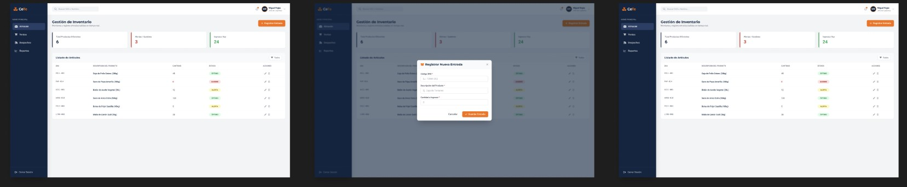

**W2. Eliminar un producto**
El administrador consulta el listado de artículos y selecciona el ícono de eliminar. El sistema muestra una ventana de confirmación para evitar eliminaciones accidentales. El usuario puede cancelar la acción o confirmar la eliminación.

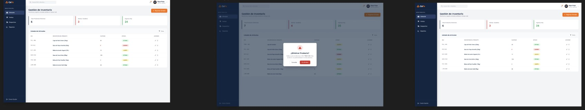

**W3. Consultar ventas**
El usuario selecciona la opción “Ventas” desde el menú lateral. El sistema muestra el módulo de ventas, donde se podrán consultar y gestionar las operaciones relacionadas con las ventas del negocio.

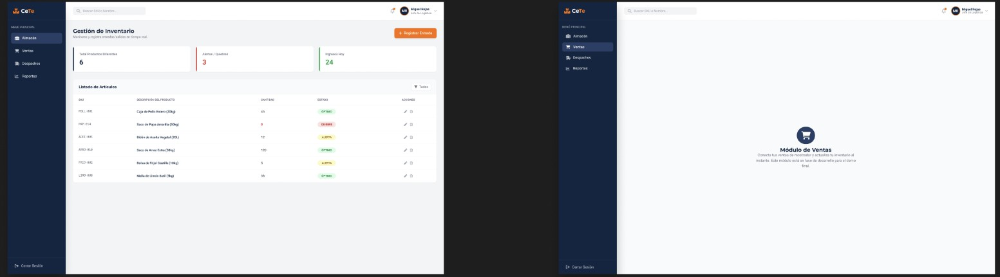

**W4. Consultar despachos**
El usuario selecciona la opción “Despachos” desde el menú lateral. El sistema muestra el módulo de rutas y despachos, destinado a organizar las salidas y realizar el seguimiento de los productos.

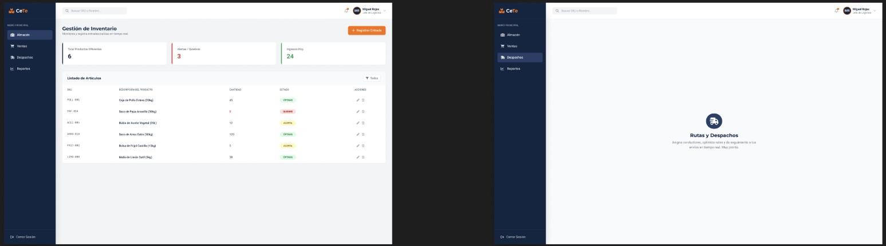

**W5. Consultar reportes**
El administrador selecciona la opción “Reportes” desde el menú lateral. El sistema muestra el módulo de balance e inteligencia, donde se podrá consultar información sobre las compras, ventas y rentabilidad del negocio.

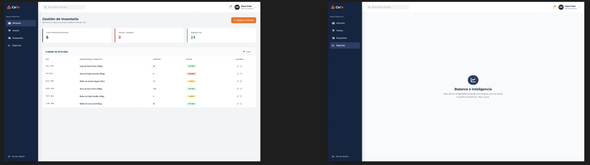

**W6. Revisar notificaciones**
El usuario accede al dashboard de inventario y selecciona el ícono de notificaciones. El sistema muestra alertas relacionadas con quiebres de stock y nuevas entradas registradas.

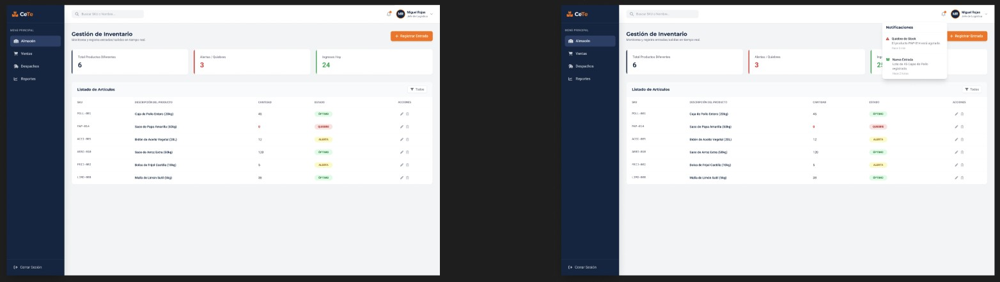

### 4.4.3. Web Applications Mock-ups

Los mockups de CeTe presentan la propuesta visual de la aplicación web para la gestión de inventario. La interfaz incluye la landing page, el dashboard de almacén, los módulos de ventas, despachos y reportes, el registro de entradas, la confirmación de eliminación y el panel de notificaciones.

El diseño utiliza un menú lateral de navegación, tarjetas de resumen, tablas de productos, botones de acción y alertas visuales. Los estados del inventario se diferencian como óptimo, alerta y quiebre de stock, lo que permite identificar rápidamente los productos que requieren atención.

La siguiente imagen muestra el conjunto de mockups desarrollados para CeTe:

  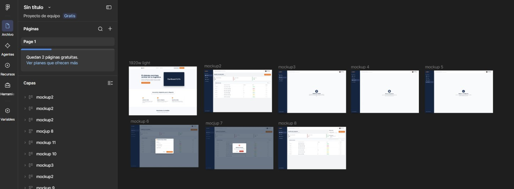

### 4.4.4. Web Applications User Flow Diagrams

A diferencia del wireflow, los diagramas de flujo de usuario detallan la lógica condicional y la validación de errores.
**User Goal:** Procesar un Despacho / Venta.
El *happy path* muestra una validación de stock exitosa. El *unhappy path* detalla la intercepción del sistema al detectar un "Quiebre de Stock", mostrando una alerta preventiva roja que bloquea la transacción.

*(Placeholder: [Imagen_UserFlow_Despacho.jpg])*

### 4.5. Web Applications Prototyping

Nuestro prototipo navegable fue construido íntegramente en Figma, configurando estados reactivos y modales interactivos para brindar retroalimentación inmediata, simulando con precisión el comportamiento ágil de una SPA (*Single Page Application*).

*(Placeholder: [Captura_Prototipo_Figma.jpg])*

## 4.6. Domain-Driven Software Architecture

A partir del entendimiento general del negocio logrado en el *Big Picture Event Storming*, hemos profundizado en la arquitectura del software aplicando *Domain-Driven Design* (DDD). En esta sección presentamos la transición de los eventos de negocio hacia artefactos de software concretos y su representación estructural utilizando el **Modelo C4**. El diseño técnico subyacente se apoyará en un backend sólido desarrollado en **C# con ASP.NET Core 8**.

### 4.6.1. Design-Level Event Storming

El equipo llevó a cabo una sesión de *Design-Level Event Storming* para refinar los eventos descubiertos y agruparlos lógicamente. Identificamos los *Commands* (acciones, notas azules) que disparan los eventos, los *Aggregates* (entidades de dominio, notas amarillas) que validan las reglas, y las *Queries* (notas verdes) necesarias para renderizar la UI.

A partir de este análisis, definimos los **Bounded Contexts** principales del sistema:
* **Warehouse Management (Core Domain):** Gobierna el control de stock, ingresos, salidas y mermas.
* **Sales & Billing:** Administra el ciclo de vida de las transacciones comerciales.

*(Placeholder: [Insertar imagen: Captura del tablero de Design-Level Event Storming])*

### 4.6.2. Software Architecture Context Diagram

En esta sección se presenta el diagrama de contexto correspondiente al Nivel 1 del Modelo C4. El propósito es ilustrar a CeTe en el centro de su entorno, interactuando con actores y sistemas externos.
* **Usuarios:** *Business Owner* (dueño con perfil gerencial) y *Warehouse Operator* (almacenero o vendedor).
* **Sistemas Externos:** El ecosistema se integra con la **SUNAT API** (para la validación de comprobantes) y con un **Email Gateway** (para envío de alertas preventivas).

  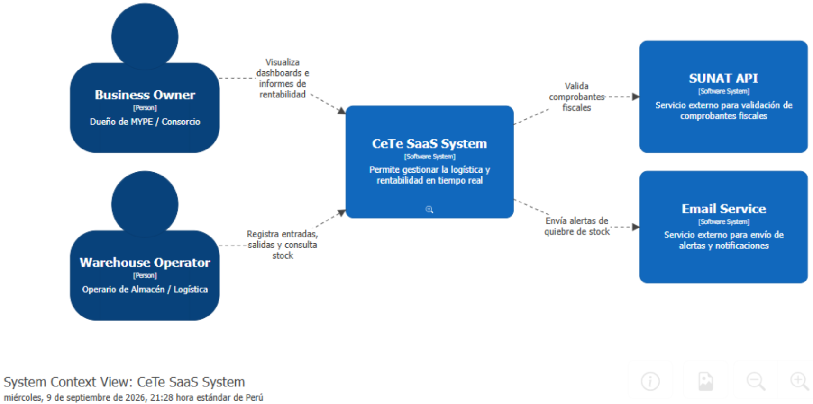
   <em>Nota. Diagrama de Contexto del Sistema elaborado aplicando el Modelo C4.</em>

### 4.6.3. Software Architecture Container Diagrams

El Diagrama de Contenedores (Nivel 2 del Modelo C4) descompone el sistema central en unidades de despliegue independientes, reflejando nuestras decisiones tecnológicas:
* **Landing Page:** Frontend estático público (HTML5, CSS3, JS).
* **Single Page Application (Frontend Container):** Desarrollada con **Vue.js y PrimeVue**. Provee la interfaz reactiva y se comunica asíncronamente vía JSON/HTTPS.
* **RESTful API Application (Backend Container):** Desarrollada en **C# con ASP.NET Core 8**. Este contenedor expone los *Endpoints* y procesa la lógica de negocio orientada a dominio.
* **Database Container:** Base de datos relacional (**PostgreSQL**) para persistir el estado transaccional del sistema.

  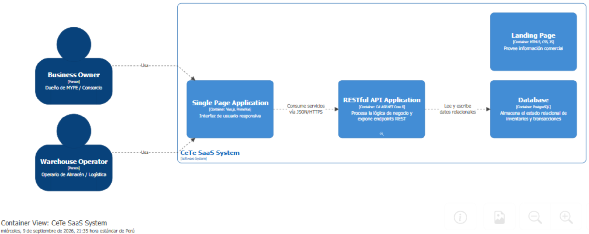
   <em>Nota. Diagrama de Contenedores ilustrando el stack tecnológico de CeTe.</em>

### 4.6.4. Software Architecture Components Diagrams

El Diagrama de Componentes (Nivel 3 del Modelo C4) hace un acercamiento al interior del contenedor del RESTful API (C#). Este diagrama muestra el flujo de ejecución: las peticiones HTTP entrantes son interceptadas por el `SecurityMiddleware`, canalizadas hacia un `InventoryController` (API endpoint), procesadas por el `InventoryService` (lógica de dominio) y finalmente persistidas utilizando el `InventoryRepository` (apoyado robustamente en **Entity Framework Core**).

  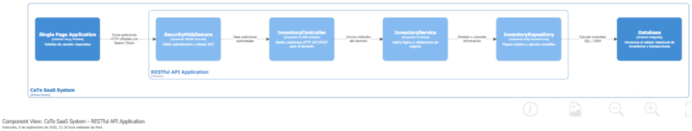
   <em>Nota. Diagrama de Componentes del Backend API de CeTe.</em>

## 4.7. Software Object-Oriented Design

En esta sección detallamos cómo los conceptos identificados en el DDD se traducen en código **C#**. El diseño orientado a objetos en CeTe protege rigurosamente los invariantes encapsulando el estado y exponiendo únicamente métodos con significado de dominio.

### 4.7.1. Class Diagrams

Los Diagramas de Clases UML mapean de manera precisa nuestras entidades del backend.
* **Clase InventoryItem (Aggregate Root):** Las propiedades de estado (ej. `Id`, `Sku`, `Quantity`) utilizan el modificador `{ get; private set; }` en C# para evitar mutaciones externas directas. Exponemos métodos públicos ricos como `AddStock(int amount)` o `DecreaseStock(int amount)` que evalúan las reglas lógicas internamente antes de alterar las cantidades.

  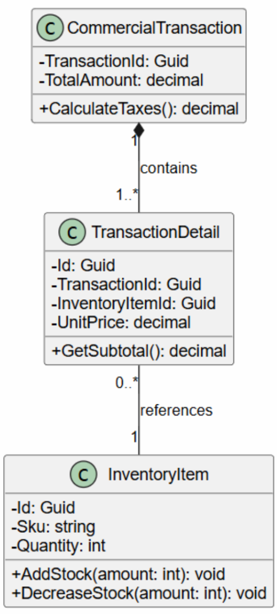
   <em>Nota. Diagrama de Clases UML modelando el comportamiento de las entidades de dominio.</em>

## 4.8. Database Design

El diseño de nuestra base de datos relacional PostgreSQL, mapeada a través de **Entity Framework Core (C#)**, respeta la separación estricta de *Bounded Contexts*, garantizando escalabilidad y consistencia de los datos.

### 4.8.1. Database Diagrams

El Diagrama Entidad-Relación (ERD) muestra la estructura física de persistencia:
* **Tabla InventoryItems:** Llave primaria en formato UUID, columnas indexadas para el código SKU y control de cantidades.
* **Tabla Transactions:** Llave primaria, montos y *timestamps*. Las relaciones foráneas se mantienen optimizadas para soportar el intenso esquema transaccional del negocio comercial y logístico.

  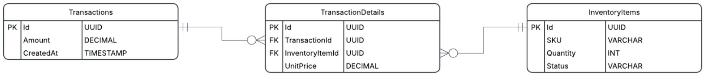
   <em>Nota. Diagrama Entidad-Relación (ERD) documentando el esquema de base de datos.</em>

# Capítulo V: Product Implementation, Validation & Deployment

## 5.1. Software Configuration Management

La Gestión de Configuración de Software (SCM) es la disciplina que permite identificar, controlar, versionar y auditar los distintos componentes de un sistema durante todo su ciclo de vida. Su aplicación asegura la trazabilidad de los cambios realizados sobre el código fuente, la documentación y los artefactos de diseño, reduciendo la probabilidad de errores de integración y facilitando el trabajo colaborativo del equipo.

En el caso de **CeTe**, la solución está compuesta por una Landing Page informativa, una Frontend Web Application y un RESTful API de elaboración interna. Durante el **Sprint 1** se priorizó la implementación, validación y despliegue de la primera versión de la **Landing Page**, desarrollada con HTML5, CSS3 y JavaScript (ES6+), manteniendo un comportamiento 100% responsive y sin dependencias de frameworks externos.

### 5.1.1. Software Development Environment Configuration

A continuación se listan los productos de software utilizados por el equipo, organizados por tipo de actividad del ciclo de vida. Para cada herramienta se indica su propósito dentro de CeTe y la ruta de referencia o descarga.

**1. Project Management**

*Descripción:* La gestión del proyecto permite organizar las actividades necesarias para alcanzar los objetivos del Sprint, asignar responsables, dar seguimiento al avance y mantener la comunicación entre los integrantes del equipo.

**Jira Software / Trello:**
Utilizado para la gestión del Product Backlog, Sprint Backlog y el seguimiento de las User Stories y Technical Stories. ([Atlassian](https://www.atlassian.com/software/jira))

  

**Google Meet & WhatsApp:**
Empleados para las ceremonias formales de Scrum (Daily, Planning, Review) y como canales de comunicación asincrónica para coordinar avances diarios.

  
  

**2. Requirements Management**

**UXPressia:**
Utilizado para la elaboración de los User Personas, Empathy Maps, Journey Maps e Impact Maps, facilitando la identificación de necesidades de los dueños de MYPEs y operarios logísticos. ([UXPressia](https://uxpressia.com/))

  

**3. Product UX/UI Design**

**Figma:**
Herramienta de diseño colaborativo en la nube empleada para elaborar los wireframes, mockups y el prototipo interactivo de CeTe, documentando nuestro Design System. ([Figma](https://www.figma.com/))

  

**4. Software Development**

**Visual Studio Code / WebStorm:**
Editores principales para el desarrollo Frontend (HTML, CSS, JS, Vue.js). La configuración de formato se estandariza mediante el archivo `.editorconfig`. ([VS Code](https://code.visualstudio.com/))

  

**Visual Studio 2022 / JetBrains Rider:**
Entornos de desarrollo integrados (IDE) robustos utilizados para la programación del Backend en C# con .NET 8.

  

**HTML5 / CSS3 / JavaScript (ES6+):**
Tecnologías base de la Landing Page desplegada en el Sprint 1.

  
  
  

**Vue.js & PrimeVue:**
Framework progresivo y biblioteca de componentes seleccionados para el desarrollo de la Single Page Application (Web App de Inventario y Ventas).

  

**ASP.NET Core & C#:**
Framework y lenguaje utilizados para el desarrollo del RESTful API de CeTe, responsable de la lógica de negocio orientada a dominio (DDD).

  

**Entity Framework Core & PostgreSQL:**
ORM y base de datos relacional definidos para almacenar el estado transaccional, inventario y métricas de CeTe.

  

**Git & GitHub:**
Sistema de control de versiones y plataforma de colaboración para alojar repositorios, aplicar GitFlow y Pull Requests.

  

**5. Software Deployment**

**GitHub Pages:**
Servicio de alojamiento estático utilizado para publicar la primera versión de la Landing Page de CeTe directamente desde la rama `main`.

  

### 5.1.2. Source Code Management

La administración del código fuente es un pilar del trabajo colaborativo del equipo. En este apartado se define el modelo organizativo y de control de versiones aplicado mediante GitHub y el flujo de trabajo GitFlow.

**1. Establecimiento de repositorios en GitHub**

La solución distribuida de CeTe se organiza en repositorios independientes:
* **Landing Page:** Repositorio dedicado al sitio web promocional del producto.
* **Frontend Web Application:** Repositorio destinado a la aplicación web (Vue.js).
* **RESTful API:** Repositorio que aloja la lógica del backend (ASP.NET Core).
* **Project Report:** Repositorio destinado a la redacción del informe en Markdown.

**2. Workflow de control de versiones (GitFlow)**

| Nombre de la rama | Descripción |
| :--- | :--- |
| **Main Branch** (`main`) | Rama base que refleja el estado de producción. Es la rama publicada por GitHub Pages. |
| **Develop Branch** (`develop`) | Rama de integración del equipo. Unifica el código de las funcionalidades en curso. |
| **Feature Branches** (`feature/*`) | Ramas temporales para desarrollar funcionalidades aisladas.   **Convención:** `feature/nombre-de-la-funcionalidad` |
| **Release Branches** (`release/*`) | Ramas de estabilización previas al pase a producción.   **Convención:** `release/vX.Y.Z` |

**3. Versionado Semántico (Semantic Versioning 2.0.0)**

CeTe adopta el estándar **Semantic Versioning 2.0.0** (`MAJOR.MINOR.PATCH`).
* Ejemplo: `v1.0.0` (Primera versión desplegada de la Landing Page).

**4. Convenciones de mensajes de commit (Conventional Commits)**

* `feat:` incorpora una funcionalidad nueva.
* `fix:` corrige un error.
* `docs:` modifica exclusivamente documentación.
* `style:` aplica ajustes de formato visual.
* `refactor:` reestructura código existente sin añadir funcionalidades.
* `chore:` tareas de mantenimiento y configuración.

### 5.1.3. Source Code Style Guide & Conventions

Como regla transversal, **toda la nomenclatura técnica (identificadores, clases, variables, funciones y métodos) se redacta exclusivamente en inglés**.

**HTML & CSS**
* Indentación de 2 espacios.
* Uso de metodología **BEM** (Block, Element, Modifier) para las clases CSS.
* Uso de *Custom Properties* (`:root`) para la paleta de colores corporativa (Primary Blue, Accent Orange).

**C# (.NET Core)**
* Indentación de 4 espacios.
* Nomenclatura `PascalCase` para clases y métodos (`InventoryController`), `camelCase` para variables locales.
* Aplicación estricta de inyección de dependencias y programación asíncrona (`Async`).

### 5.1.4. Software Deployment Configuration

**1. Landing Page (GitHub Pages)**
* **Plataforma de hosting:** GitHub Pages.
* **Origen del despliegue:** contenido estático de la rama `main` del repositorio.
* Se incorpora el archivo `.nojekyll` para garantizar la correcta carga de la carpeta `/assets`.

**2. Frontend y RESTful API (Proyección)**
El despliegue de las aplicaciones reactivas y servicios backend se configurará utilizando servicios Cloud escalables (Ej. Azure App Services, AWS o Vercel), garantizando alta disponibilidad para las MYPES.

## 5.2. Landing Page, Services & Applications Implementation

### 5.2.1. Sprint 1

Durante el Sprint 1, el equipo de Nexxus se concentró en la implementación y despliegue de la primera versión funcional y responsive de la Landing Page de CeTe, diseñada para captar a nuestro público objetivo (Dueños de MYPEs y Operarios).

#### 5.2.1.1. Sprint Planning 1

| Sprint # | Sprint 1 |
| :--- | :--- |
| **Sprint Planning Background** | |
| Date | 08/09/2026 |
| Time | 8:00 PM |
| Location | Google Meet (reunión virtual) |
| Prepared By | Salazar Marquina, Kevin Junior |
| Attendees | Anahua Ancachi, Liz Maribel Campoblanco Guzman, Diego Roberto Montes Chang, Piero Francisco Salazar Marquina, Kevin Junior Salazar Quiche, Darikson Bill |
| **Sprint 1 Review Summary** | Durante este primer ciclo el equipo consolidó los artefactos de UX definidos en los capítulos anteriores y los tradujo en una implementación web funcional. Se desarrolló y desplegó la primera versión de la Landing Page de CeTe, la cual comunica la propuesta de valor orientada a la centralización B2B de inventario y ventas. Se implementaron el Hero section, los planes de suscripción, diseño responsive y adaptabilidad móvil. |
| **Sprint 1 Retrospective Summary** | El equipo evaluó positivamente la distribución del trabajo mediante la convención de ramas `feature/*` de GitFlow, reduciendo colisiones de código. Como oportunidad de mejora, se debe afinar la estimación de las tareas de internacionalización (i18n) para el próximo ciclo. |
| **Sprint Goal & User Stories** | |
| **Sprint 1 Goal** | *Our focus is on* publicar la primera versión funcional y responsive de la Landing Page de CeTe. *We believe it delivers* a las MYPES una comprensión rápida de nuestra solución B2B. *This will be confirmed when* el sitio sea accesible desde cualquier dispositivo, mostrando claramente la propuesta y los planes de suscripción. |
| **Sprint 1 Velocity** | 24 |
| **Sum of Story Points** | 24 |

#### 5.2.1.2. Aspect Leaders and Collaborators

| Team Member | Landing Page (código) | Diseño UI/UX | Documentación | Deployment |
| :--- | :--- | :--- | :--- | :--- |
| Anahua Ancachi, Liz | Colaborador | Líder | Colaborador | Colaborador |
| Campoblanco, Diego | Colaborador | Colaborador | Colaborador | Líder |
| Montes Chang, Piero | Colaborador | Colaborador | Líder | Colaborador |
| Salazar, Kevin | Líder | Colaborador | Colaborador | Colaborador |
| Salazar, Darikson | Colaborador | Colaborador | Colaborador | Colaborador |

#### 5.2.1.3. Sprint Backlog 1

| Story ID | Work Item / Task Title | Description | Est. (h) | Assigned To | Status |
| :--- | :--- | :--- | :---: | :--- | :---: |
| US24 | Estructuración base e implementación del Hero | Creación del esqueleto semántico (`header`, `main`, `section`, `footer`) y propuesta de valor principal. | 4 | Salazar, Kevin | Done |
| US25 | Implementación de la sección de Funcionalidades | Maquetación de la grilla mostrando "Inventario en tiempo real", "Dashboard", etc. | 3 | Anahua, Liz | Done |
| US26 | Maquetación de la sección de Planes | Tarjetas de suscripción con precios para las MYPES. | 3 | Salazar, Darikson | Done |
| US29 | Implementación de navegación responsive | Desarrollo del header fijo, scroll suave y menú hamburguesa para móviles. | 4 | Campoblanco, Diego | Done |
| US33 | Implementación del Footer Institucional | Creación del pie de página con enlaces legales y redes sociales. | 2 | Montes, Piero | Done |
| US34 | Despliegue en GitHub Pages | Configuración del repositorio y publicación de la versión v1.0.0. | 2 | Campoblanco, Diego | Done |

#### 5.2.1.4. Development Evidence for Sprint Review

Esta sección expone la evidencia técnica del progreso alcanzado. La Landing Page de CeTe fue desarrollada utilizando HTML5, CSS3 y JavaScript bajo un enfoque Mobile-First.

**Registro de commits del Sprint 1:**

| Repository | Branch | Commit Id | Commit Message | Commited on |
| :--- | :--- | :--- | :--- | :--- |
| cete-landing-page | `feature/hero-section` | `[COMMIT_ID]` | feat: implement hero section with value proposition | `[DD/MM/2026]` |
| cete-landing-page | `feature/plans-section` | `[COMMIT_ID]` | feat: add B2B subscription plans cards | `[DD/MM/2026]` |
| cete-landing-page | `feature/responsive-nav` | `[COMMIT_ID]` | feat: add mobile burger menu and sticky header | `[DD/MM/2026]` |
| cete-landing-page | `main` | `[COMMIT_ID]` | chore: prepare release v1.0.0 and trigger gh-pages | `[DD/MM/2026]` |

  

  

  

#### 5.2.1.5. Execution Evidence for Sprint Review

Se validó el comportamiento responsive, el menú móvil y las secciones de la Landing Page en navegadores de escritorio y dispositivos móviles.

  

  

  

  
  
  
  

#### 5.2.1.6. Services Documentation Evidence for Sprint Review

Durante el Sprint 1, la Landing Page es un sitio estático informativo. La integración con los servicios RESTful internos (endpoints de autenticación, inventario y despacho documentados mediante Swagger/OpenAPI) se incorporará en los siguientes Sprints desde la Web Application en Vue.js.

#### 5.2.1.7. Software Deployment Evidence for Sprint Review

La versión `v1.0.0` de la Landing Page fue publicada exitosamente utilizando GitHub Pages automatizando el despliegue a partir de la rama `main`.

  

#### 5.2.1.8. Team Collaboration Insights during Sprint

El equipo gestionó el desarrollo utilizando repositorios de GitHub. Se aplicaron Pull Requests con revisiones cruzadas. A continuación, las analíticas de colaboración:

  

## 5.3. Validation Interviews

### 5.3.1. Diseño de entrevistas

Para el proceso de validación, hemos diseñado sesiones interactivas donde los usuarios evalúan nuestros productos digitales de CeTe, basándonos en escenarios reales de uso.
* **Segmento 1 (Dueños/Gerentes):** Se evalúa la Landing Page en su versión Desktop, analizando la comprensión de la propuesta de valor, claridad de precios y la intención de conversión.
* **Segmento 2 (Operarios/Logística):** Se evaluará el prototipo interactivo de la Web Application (Módulo de Inventario), midiendo la facilidad de uso y prevención de errores (Stock Out).

### 5.3.2. Registro de Entrevistas

**Entrevista de Validación 1 (Segmento 1 - Dueño/Administrador)**
* **Nombre:** Jesús V.C.
* **Edad:** 28 años
* **Distrito:** San Miguel
* **URL del Video:** [Ver entrevista (OneDrive)](https://1drv.ms/v/c/e88873f5d7dca6f3/IQBGbGRWY2rUQ538hXef1EzLAdgfob7Mw59Zjm2DJZ55iCg?e=hPPCtx)

  

* **Resumen de la evaluación:**
  El usuario interactuó con la Landing Page. Comprendió rápidamente que el sistema centraliza inventario, ventas y facturación. Destacó como funcionalidades más valiosas el "Balance Inteligente" (para cruzar compras y ventas) y el "Monitoreo y Alertas" (para evitar quiebres de stock). Se identificó plenamente con el dolor de no poder estar físicamente en el local todo el día, validando la necesidad del Dashboard. Como sugerencias críticas, indicó que la página carece de una sección explícita de precios o planes y recomendó fuertemente implementar un botón flotante de WhatsApp para consultas rápidas.

**Entrevista de Validación 2 (Segmento 2 - Operario de Almacén)**
* **Nombre:** Luis Llanos
* **Edad:** 28 años
* **Distrito:** Santiago de Surco
* **URL del Video:** [Ver entrevista (OneDrive)](https://1drv.ms/v/c/e88873f5d7dca6f3/IQBrUEoZT2CBRJ2rlCxRdA_zAfMIUn-hNsRdc9TrtVkJP1k?e=bM1yV4)

  

* **Resumen de la evaluación:**
  El usuario interactuó con los mockups de alta fidelidad en Figma. Identificó intuitivamente el menú lateral para la "Gestión de Inventario" y el botón para "Registrar Entrada". Al evaluar el formulario de ingreso, sugirió implementar una función para escanear códigos de barras con la cámara del celular, a fin de agilizar el proceso y evitar errores de tipeo. Al analizar la pantalla de alertas, observó que falta un flujo o botón específico para registrar "Mermas" o productos dañados, lo cual es crítico para no alterar los reportes.

### 5.3.3. Evaluaciones según heurísticas

A partir del feedback recopilado, analizamos la interfaz basándonos en las heurísticas de Nielsen para aplicar mejoras iterativas al producto.

| # | Problema | Escala de severidad | Heurística / Principio violado |
| :---: | :--- | :---: | :--- |
| 1 | La Landing Page no cuenta con una sección explícita de "Precios" o "Planes", lo que frena la decisión de registro del usuario y genera incertidumbre. | 3 (Problema mayor) | Arquitectura de la Información / Coincidencia entre el sistema y el mundo real. |
| 2 | Ausencia de un canal de contacto rápido (botón de WhatsApp o soporte flotante) para resolver dudas antes de crear la cuenta B2B. | 2 (Problema menor) | Usabilidad: Ayuda y documentación. |
| 3 | El formulario de ingreso de mercadería requiere tipear el SKU a mano, lo que aumenta el riesgo de error humano y demora el proceso. | 3 (Problema mayor) | Usabilidad: Flexibilidad y eficiencia de uso. |
| 4 | No existe un botón o flujo específico y claro para registrar productos dañados (Mermas) desde la vista del operario. | 3 (Problema mayor) | Usabilidad: Prevención de errores. |

---

## 5.4. Video About-the-Product

**Enlace del Video Promocional:** [PROMO - CeTe (YouTube)](https://youtu.be/EBS8s4CFWRo)

---

## Conclusiones

* **Validación de Problema:** La investigación estructurada validó nuestros *Assumptions* principales: Las MYPES peruanas sufren pérdidas económicas reales por falta de trazabilidad y requieren urgentemente herramientas con cero fricción operativa, descartando los ERPs complejos.
* **Diseño Centrado en el Usuario:** El diseño del Landing Page y el modelado de la Web App de CeTe lograron materializar las expectativas de nuestros User Personas. Se equilibró exitosamente la necesidad de simplicidad táctil para el operario logístico (Miguel) y el control financiero analítico para el dueño (Carlos).
* **Arquitectura Sólida:** La aplicación de Domain-Driven Design (DDD) y la representación visual mediante el Modelo C4 nos permitieron establecer bases técnicas modulares y escalables (Vue.js + ASP.NET Core), preparando a la plataforma para el crecimiento transaccional y futuras integraciones IoT.
* **Gestión Ágil:** La aplicación rigurosa de metodologías ágiles, evidenciada en nuestro Product Backlog, ceremonias Scrum y flujos de integración continua (GitFlow), aseguró entregas de valor constantes y un ambiente de colaboración profesional.

---

## Video About-the-Team

*Enlace del Video About The Theam: https://drive.google.com/drive/folders/1xVEEo9wgbIuEtw1UIYaJLxzBtxMa2upI?usp=sharing *

---

## Bibliografía

* Instituto Nacional de Estadística e Informática. (2022). *Producción nacional: Informe técnico*. INEI. https://www.inei.gob.pe/media/MenuRecursivo/boletines/boletin-estadistico-del-sector-servicios-n-12-diciembre-2022.pdf
* Evans, E. (2003). *Domain-Driven Design: Tackling Complexity in the Heart of Software*. Addison-Wesley Professional.
* Centro Nacional de Planeamiento Estratégico. (2023). *Políticas y estrategias nacionales de desarrollo agroalimentario*. CEPLAN. https://www.ceplan.gob.pe/documentos_/politicas-y-estrategias-nacionales/
* Ministerio de Trabajo y Promoción del Empleo. (2023). *Informe anual del empleo en el Perú 2022*. MTPE. https://cdn.www.gob.pe/uploads/document/file/4558080/Informe_Anual_del_Empleo_Peru_2022.pdf
* Ministerio de Transportes y Comunicaciones. (2022). *Anuario estadístico 2022*. MTC. https://portal.mtc.gob.pe/estadisticas/publicaciones/anuarios/ANUARIO_ESTADISTICO_2022.pdf

---

## Anexos

* **Repositorio de Landing Page:** https://github.com/Nexxus-ops/nexxus-landing-page.git
* **Link de video promocional:** https://youtu.be/EBS8s4CFWRo
* **Link del drive con videos de entrevistas y about the team:** https://drive.google.com/drive/folders/1xVEEo9wgbIuEtw1UIYaJLxzBtxMa2upI?usp=sharing
